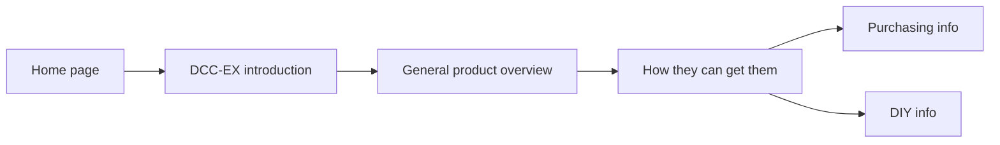
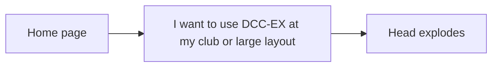

# User Personas and Journeys

Use these Mermaid diagrams to help ensure the various user types can navigate successfully from the front page to get to the information they require.

## New to DCC-EX

These users don't really know what DCC-EX is, but saw it at their club, on a YouTube channel, at a show, or someone told them they should check it out.

## Ready-to-Run CSB1

These users just purchased their brand new shiny EX-CSB1 and want to get up and running with it ASAP.

## Large Club Layout

These users are aware of DCC-EX and know enough to be able to start implementing it on a large club layout. They want to know about wiring, boosters, power districts, multiple wired and wireless throttles, and connecting accessories.

