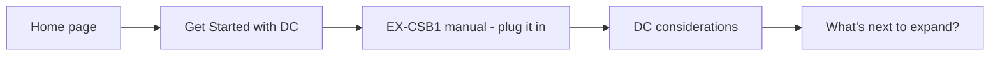

# User Personas and Journeys - Front Page Tiles

Use these Mermaid diagrams to help ensure the various user types can navigate successfully from the front page to get to the information they require.

## New to DCC-EX

These users don't really know what DCC-EX is, but saw it at their club, on a YouTube channel, at a show, or someone told them they should check it out.

## Ready-to-Run CSB1

These users just purchased their brand new shiny EX-CSB1 and want to get up and running with it ASAP. They need to know how to connect it safely to their layout, how to connect a throttle (eg. EX-WebThrottle, Engine Driver), and how to power it.

## DC Ready-to-Run Users

These users are similar to the above but want to run their existing DC trains. They may have a large collection that is too expensive or difficult to convert. They also need to know how to connect it to the layout and connect throttles as well as how to power it, but they also need to understand about isolation between the track outputs and potentially PWM sync issues.

## Existing Users Adding Accessories

These users already have a CSB1 or DIY stack up and running and want to extend to using accessories including turnouts, signals, sensors, turntables, and so forth. They need to know how to physically connect them (I2C) and enable them in software (myAutomation.h). This will move them from Conductor into early Tinkerer territory for I2C in particular.

## Existing Users Looking to Automate/Animate

These users already have a CSB1 or DIY stack up and running and may or may not have accessories as well. They want to understand how to automate and/or animate running trains and/or their layout in general. This may be as simple as a shuttle running back and forth between two stations, or a complex display running trains, controlling various layout aspects (eg. lighting, cross gates), and automating shunting or routes across different tracks. This will definitely be out of Conductor territory but is all about EXRAIL, although guidance on what hardware is required to achieve these will be required.

## Large Club Layout

These users are aware of DCC-EX and know enough to be able to start implementing it on a large club layout. They want to know about wiring, boosters, power districts, multiple wired and wireless throttles, and connecting accessories.

## Downloader

These users already know enough and just want a quick way to get the latest version of software.

