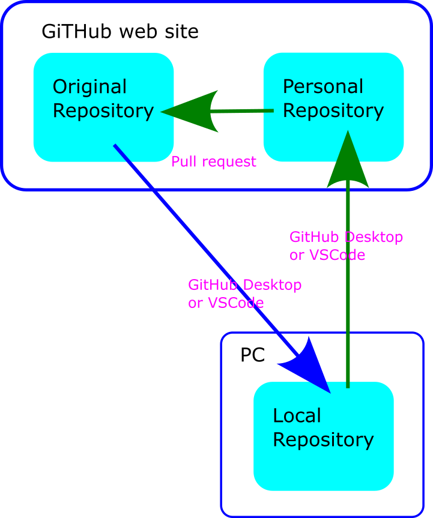
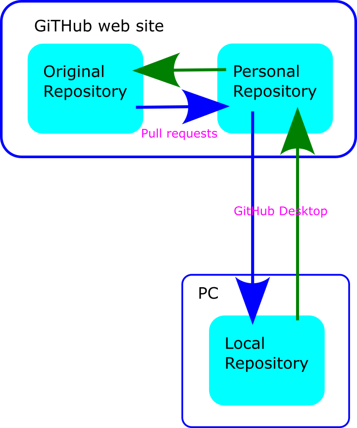

# GitHub repository

In order for GitHub pages to function correctly and automatically publish updated content, the content must be located in a specific repository named after the GitHub organisation, and therefore our website repository is [mkdocs-test](https://github.com/DCC-EX/mkdocs-test).

The default branch is called "main", so any branches created for contributing to documentation must use this as the parent, and all pull requests must be submitted against this same branch.

## Procedure

### Procedure overview

Ideally the documentation cycle would look like this..

{ width=400px}

Changes to the original would be pulled down from the original repository directly to your local (PC) repository.  You would push your changes to your GitHub website repository. Then create a *Pull request* to send them to the original for review.

While this is possible, both **GitHub Desktop** and **VSCode** make it extremely cumbersome to do so.

*So instead a slightly longer approach is described below...*

{ width=400px}

Changes to the original would be pulled down from the original repository to your GitHub website repository with a *Pull Request*.  You will then pull those changes to you local (PC) repository. You will push your changes to your GitHub website repository. Then create a *Pull Request* to send them to the original for review.

There are a number of possible ways to do this but the instructions below are reasonably simple and work:

After installing the required software (particularly **GitHub Desktop** and **VSCode**) ...

One time only:

1. Cloning the repository on the **GitHub website**
2. Using **GitHub Desktop** to download the repository to your PC

Ongoing:

3. Opening the repository in **VSCode**
4. Making your changes
5. Previewing your changes on your PC
6. Using **GitHub Desktop** to *push* your changes back to your clone of the Repository on GitHub
7. Creating a *pull request* to send your changes for review

You will periodically need to update your repository:

a. Create a pull request on the **GitHub website** to get any changes from the original repository to your repository on GitHub website
b. Use **GitHub Desktop** to pull the changes to your repository on your PC

----

### One time only

#### 1. Cloning the repository on GitHub website

1. First you will need to create an account on Github if you don't already have one.
2. Go to the original repository ``https://github.com/DCC-EX/mkdocs-test``
3. Click on the `Fork` button and create a new fork.  (Do not alter the Repository name ``mkdocs-test``.)

You will now have a new fork located at ``https://github.com/<your_account_name>/mkdocs-test``.  Take note of this for the next step.

#### 2. Download the repository to your PC with GitHib Desktop

In **GitHub Desktop**:

1. Select `File --> Clone Repository`
2. Enter the name of you repository ``<your_account_name>/mkdocs-test``
3. Select a location on your PC to store the repository.
4. Click `Clone`
5. Make sure that ``Sphinx`` is selected as the 'Current Branch'

A copy of the repository should now be on the PC.

You can open it in VSCode by selecting ``Repository -> Open in Visual Studio Code``

----

### Ongoing

#### 3. Open the repository in VSCode

You can open the repository in VSCode at any time by using `File --> Open Folder` and navigating to the folder you selected in step 2.

You can subsequently open the repository in VSCode using `File --> Open Recent` and selecting the repository name.

You can also open the repository in VSCode from **GitHub Desktop**.

#### 4. Make your changes

You can use the navigation tree on the left to find the file you want to change. Clicking on a file will open it in the edit window.

While editing, be sure to save often (auto-save should be on by default), preview and commit your changes, and publish them. This way, should anything go wrong with your computer, your work will be saved in GitHub rather than be lost.

#### 5. Live previews

Providing you followed the installation guide for VSCode on the page accurately, there are several methods available for generating previews as you are editing the code.

==TODO== LOW - how to preview options

* In VSC, you can get a basic preview with the preview button (icon of two pages with a magnifying glass). Top right of the editing page.  This only shows basic formatting.

* You can push to your github repository and view the build (see below).

* On MS Windows you can use one of the `.bat` files to get a full preview:

    * local_build_for_win11.bat
    * local_dirty_build_for_win11.bat
    * local_serve_dirty_for_win11.bat
    * local_serve_for_win11.bat

``local_serve_for_win11.bat`` is the simplest and most accurate but is slow.

#### 6. Push your changes to your GitHub repository

You will need to:

* Commit your changes
* Push your changes

In **GitHub Desktop**:

1. Open/select the repository
2. note and review the changes that have been made
3. Add a ``Summary`` of your changes
4. Add a ``Description`` of your changes, if the summary is not sufficient
5. click `Commit to main`
6. click `Push origin`

#### 7. Creating a *pull request* to send your changes for review

1. Open the **GitHub website**
2. Open/select your repository ``https://github.com/<your_account_name>/dcc-ex.github.io``

On the 'code' page you should see "This branch is *x* commit(s) ahead of DCC-EX/dcc-ex.github.io:sphinx."

3. Click on the `x commit(s) ahead of` hyperlink
4. Confirm or add to the title and documentation fields
5. Click on the `Create pull request` button

This creates a pull request to be reviewed by the documentation team

----

### Periodic

To see the changes that other people have made to the original repository you need to periodically refresh your repository on both GitHub website and locally.

#### a. Get any changes to your repository on GitHub website

1. Open the **GitHub website**  
2. open/select your repository ``https://github.com/<your_account_name>/mkdocs-test``

On the 'code' page you should see "This branch is *x* commit(s) behind DCC-EX/mkdocs-test."

If does not say you are 'behind' there is nothing to do.  Stop here.

If you are behind...

3. Click on the `x commit(s) behind` hyperlink  
5. Add to the title and/or documentation fields.  This does not matter so entering just ``Catchup`` is fine.  
6. Click on the `Create pull request` button  
7. Click on the `Merge pull request` button  
8. Click on the `Confirm merge` button

Any changes are now also in your repository on the GitHub website.

#### b. Pull the changes to your repository on your PC

In **GitHub Desktop**:

1. Click on the `Fetch origin` button

Any changes are now also in your repository on the PC.

----

## Additional

### Your own github pages

You can, optionally, setup *github pages* from you own repository on the GitHub website.  This allows you to make changes that *other people* can view before creating a pull request.

1. In your forked repository settings, navigate to ``Settings -> Pages``
2. Under ``Build and deployment, Source`` confirm ``Deploy from a branch`` is selected
3. User ``Build and deployment, Branch`` confirm ``gh-pages`` and ``/root`` are selected.
4. Click ``save``

Now, each time you commit and push to your fork or merge a pull request to it, it should automatically build a new pages deployment and publish it.

Building the pages and deploying takes time, every time you push any changes, but you will eventually be able to see your own version of the website at ``https://<your_account_name>.github.io/mkdocs-test/``.

You can see the state of the processing of your changes by looking at the ``Actions`` page.  It will also tell you there if there are any errors.
