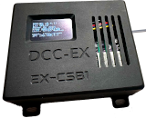
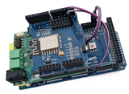

---
hide:
  - navigation
  - toc
  - footer
  - title
---
<!-- This style block is to "hide" the title, it must be defined in order for MkDocs to work correctly -->

# Home

- ## :material-hand-wave-outline: Welcome to DCC-EX

    Our highly regarded open source [Command Station](./products/ex-commandstation/index.md) is one of the most comprehensive available, with many unique features designed to bring control and fun to your hobby:

    - Use your smart devices (phones and tablets) to control your trains and run your layout over WiFi. Or use one of the many commercial and DIY physical WiFi throttles.
    - Able to run DCC and DC trains from the same throttle at the same time.
    - Equipped with the powerful [EXRAIL](/products/ex-commandstation/exrail/index.md) scripting to easily implement a roster and accessories such as turnouts/points, routes, signals, lights, and sounds. EXRAIL can also automate your trains and animate your layout!
    - Integration with [JMRI](https://www.jmri.org/), [iTrain](https://www.berros.eu/en/itrain/), and [RocRail](https://wiki.rocrail.net/) if you prefer to run trains from your computer.

    ---
     [{ align=right }](./products/ex-commandstation/ex-csb1.md)
    Our flagship ready-to-run [**EX-CommandStation Booster 1 Express**](/products/ex-commandstation/ex-csb1.md) (**EX-CSB1**) is available for purchase, complete with WiFi and power supply. With your own phone, you could be running your trains in less than 5 minutes. *No computer required.*  
    To purchase one, [check out our official suppliers](/purchasing/official-sellers.md).  
    To get started with an **EX-CSB1** [read the product page](/products/ex-commandstation/ex-csb1.md).

    ---
    [{ align=right}](/diy/diy.md)
    Or you can enjoy [building your own](/diy/diy.md), staggeringly inexpensive, version from readily-available Arduino/MicroController parts.  
    Our design makes this easy for beginners. *No soldering required.*  
    Of course, we also have a wealth of information for more adventurous builders if you have the appropriate electronics skills.

    ---

    Both the ready-to-run and self-build systems use the same powerful [EX-CommandStation](/products/ex-commandstation/index.md) software, which is totally free and easy to configure using our [installation tool](./installer/installer.md).

    We also have a continually evolving range of additional [products](/products/products.md) to enhance your entire layout including an integrated fast clock, integrated turntable controller, and I/O expansion.

- ## :material-help-box-multiple-outline: What is DCC-EX

    **DCC-EX** is world-wide team of dedicated enthusiasts producing **free** and open source **DCC** and **DC** software and hardware solutions to run your model trains and layout.  
    Our mission is to use our many decades of software and hardware experience to make model trains accessible and affordable to everyone.

    You can learn more on our [About Us](/about/about.md) page.

    ---

    This website contains a vast amount of information, ranging from how to run your first train to how to automate a large exhibition layout.

    The navigation buttons above should help you find what you want and the search facility is extremely powerful.

    There is a light/dark mode button beside the search bar.

    <small>This site does not use Third Party Cookies.</small>

