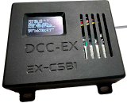
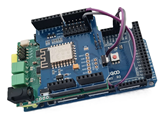
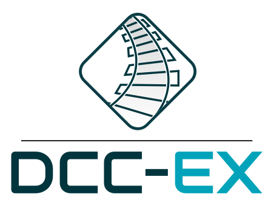

<!-- This style block is to "hide" the title, it must be defined in order for MkDocs to work correctly -->

# Home

- ## :material-hand-wave-outline: Welcome to DCC-EX

    Our free, open source, [Command Station](./products/ex-commandstation/index.md) software is one of the most comprehensive available. It comes with many *in-built* features which are unavailable or 'extras' in most commercial command stations. Including:

    - *WiFi*. Use smart phones &amp; tablets, or commercial and DIY physical throttles, to control your trains and layout.
    - Run either, or both, *DCC* and *DC* trains from the same throttle.
    - Add a *loco roster* and accessories such as turnouts/points, routes, signals, lights, and sounds.
    - *Automate* your trains and *animate* your layout with the powerful [EXRAIL](./products/ex-commandstation/exrail/index.md) scripting.
    - Integrate with [JMRI](https://www.jmri.org/), [iTrain](https://www.berros.eu/en/itrain/) or [RocRail](https://wiki.rocrail.net/) if you prefer to run trains from your computer.

    Our [ready-to-run](./products/ex-commandstation/ex-csb1.md) and [self-build](./diy/diy.md) systems use this same outstanding [**EX-CommandStation**](/products/ex-commandstation/index.md) software. Configuration is easy using our [**EX-Installer**](./installer/installer.md) app.

    ---
    [{ align=left width=140px .homepage_img }](./products/ex-commandstation/ex-csb1.md) The [**EX-CommandStation Booster 1 Express**](./products/ex-commandstation/ex-csb1.md) (**EX-CSB1**) is our flagship, WiFi enabled, *ready-to-run* system and is available for [purchase now](./purchasing/official-sellers.md) from our [official suppliers](./purchasing/official-sellers.md).  
    With your phone, you could be running your trains in less than 5 minutes. *No computer required.*  
    [Read the product page](./products/ex-commandstation/ex-csb1.md) for more information on the **EX-CSB1** .

    ---
    [{ align=right width=140px .homepage_img }](./diy/diy.md)
    Or you can enjoy [building your own](./diy/diy.md), staggeringly inexpensive, version from readily-available Arduino/MicroController parts.  
    Our flexible designs range from *easy build* systems for beginners (no soldering required) up to very powerful, but more complex, systems for the adventurous.

    ---

    We also have a continually evolving range of additional [products](./products/products.md) to enhance your layout, including an integrated fast clock, turntable controller, and I/O expansion.

- ## :material-help-box-multiple-outline: What is DCC-EX

    { align=right width=80px } **DCC-EX** is world-wide team of dedicated enthusiasts producing free and open source DCC and DC *software* and *hardware* solutions to run your model trains and layout.

    *Our mission* is to make model trains accessible and affordable to everyone.

    Learn more on our [About Us](./about/about.md) page.

    ---

    This website contains a vast amount of information, ranging from how to run your first train to how to automate a large exhibition layout.

    Use the navigation buttons or search facility above to find what you need.

    There is also a light/dark mode button beside the search bar.

    <small>This site does not use Third Party Cookies.</small>

