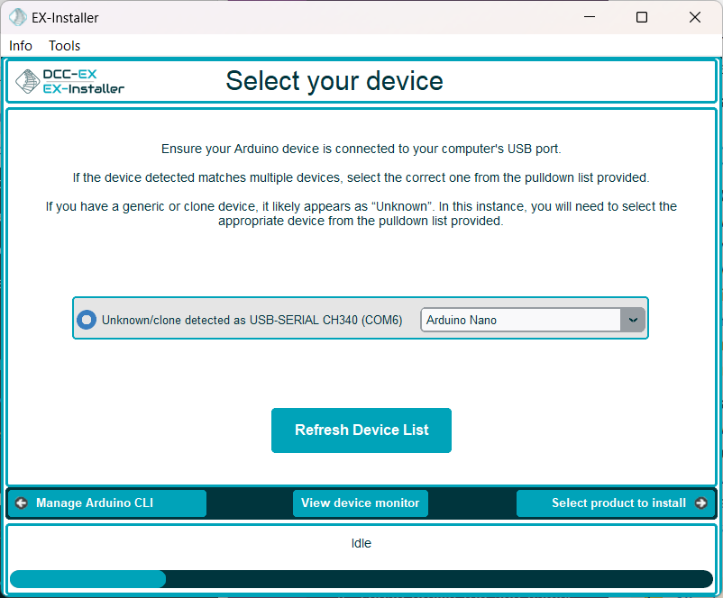
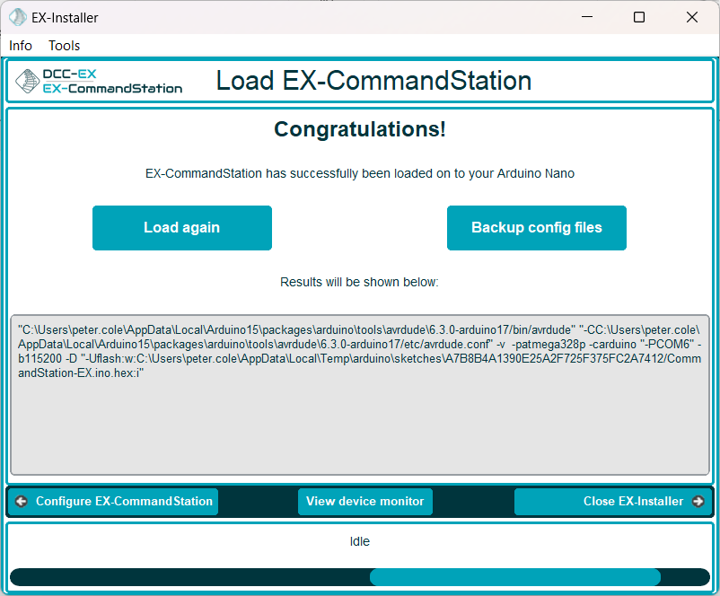
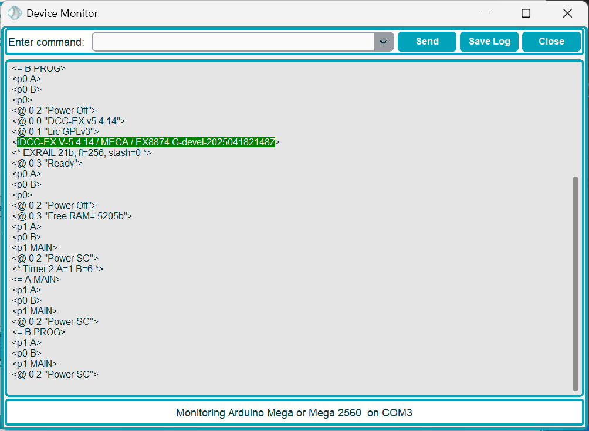
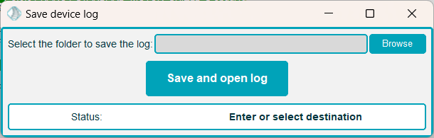

# Testing your installation With EX-Installer

With a Serial Monitor you can, among other things:

* Test your Command Station
* View startup and other diagnostic logs to fix issues or help us support you
* Turn on extra diagnostic commands
* Diagnose communication issues with your loco on the programming track (ACK failure/Error 308)

## Using the EX-Installer Device Monitor

Once you have selected a device in **EX-Installer** on the 'Select your device' screen, or after successfully loading software onto your device, a ``View device monitor`` button will be available.

{ width=400px }

{ width=400px }

When clicking this button, the Device Monitor window will open, allowing you to interact with your device by sending commands and viewing the serial console output.

{ width=400px }

Within the Device Monitor window, you will see the serial console output of your device. As you can see in this screen shot, certain key bits of information are highlighted to help identify these when asked by the **DCC-EX** team.

The following information is highlighted for **EX-CommandStation**:

- **EX-CommandStation** version information (green)
- WiFi firmware version (green)
- WiFi SSID and password in access point mode (blue)
- WiFi SSID in station (STA) mode (blue)
- WiFi IP address and port (purple)

### Sending commands

You can send any supported command to your device by typing it into the "Enter command" box and clicking the "Send" button. Refer to the [Serial Commands List](../reference/serial-command-list.md) for the list of available commands. This will also work for the **EX-Turntable** and **EX-IOExpander** commands.

### Saving startup or serial console logs

When interacting with the **DCC-EX** team for support, you will likely be asked to provide the "startup logs", or output from the serial console of your device.

Using Device Monitor is the simplest way to obtain this information by using the ``Save log`` button.

{ width=400px }

Using this option, you can browse to a location on your computer you can easily find (such as your Desktop), allowing you to upload this to Discord or a GitHub issue and share with the team.

When clicking the ``Save and open log`` button, it will save the file, but also open it on your screen. This way, if you're unable to upload the file for some reason, you can copy and paste the text instead.

----

## Using Other Serial Monitors

There are several other serial monitors available that can be used for testing:

- Built in to the EX-WebThrottle
- Built in to JMRI or other train control software.
- Built in to VSCode is you are using that as an IDE.
- Built in to the Arduino IDE (We do not recommend that for development)

See [Serial Monitors](../reference/tools/serial-monitor_not_in_nav.md) for more information.

--8<-- "snippets/abbr.md"
