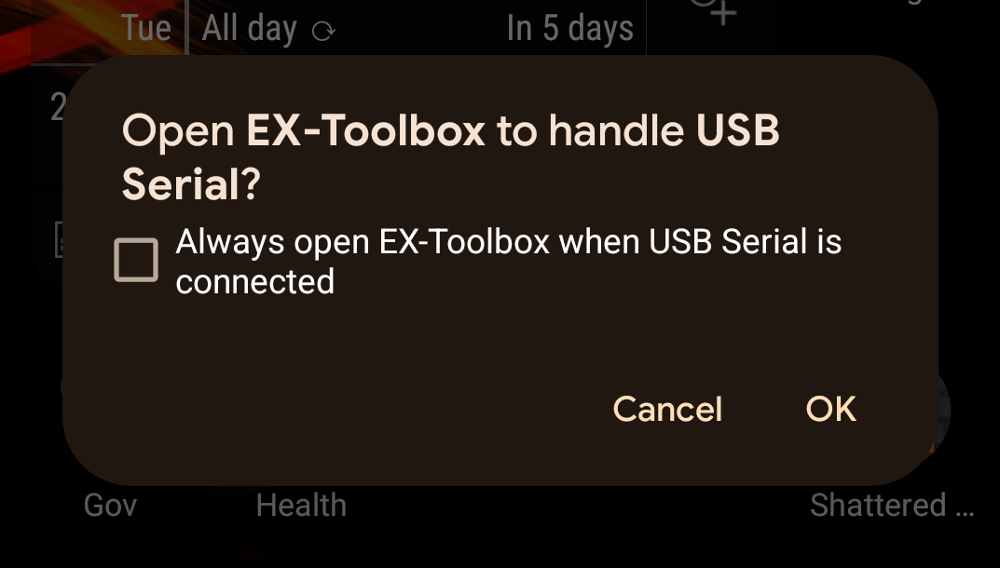
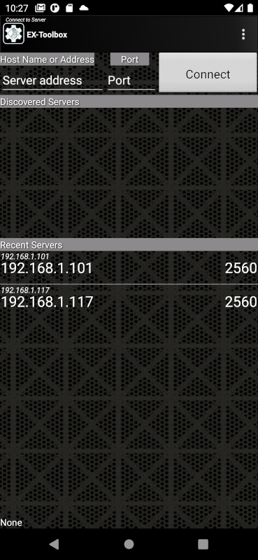

# Installing EX-Toolbox

This page explains how to install the **EX-Toolbox** Android app on your Android device, or through emulation, on a Windows or macOS PC.

## Installing EX-Toolbox on an Android phone or tablet

{ width=150px align=right }

- Open the [Play Store app](https://play.google.com/store/apps/details?id=dcc_ex.ex_toolbox) on your Android phone or tablet and search for 'EX-Toolbox'. Or use the QRCode below

- Once installed, open **EX‑Toolbox** and it will go through the initial setup wizard where it will ask for one permission, and for which which theme you would like to use.

- After you complete the setup wizard, you will be shown the 'Connection' Screen.

## Installing EX-Toolbox on MS Windows & macOS

**EX-Toolbox** and all the Android based throttle apps listed can be run on Microsoft Windows PCs and Apple Silicon Macs using BlueStacks.

***BlueStacks***

The [BlueStacks](https://www.bluestacks.com/) app allows you to install and run most Android apps on most recent Windows PCs.

It has the advantages of:

- Works on most recent Windows PCs and Apple Silicon Macs

- User Friendly installation of apps

- Allows you to run multiple instances of same app at the same time

Disadvantages include:

- Has advertisements

Follow the instructions on their [site](https://www.bluestacks.com/)  to install BlueStacks, then get the appropriate .apk to install the throttle app you want. e.g. The Engine Driver .apk is available from the [EX-Toolbox Github page](https://github.com/DCC-EX/EX-Toolbox/tree/master/EX_Toolbox/apks).

## Connecting to your EX-CommandStation

Please remember that to connect to a WiFi **EX-CommandStation** on the correct WiFi network.

- If you are running your **EX-CommandStation** in Access Point (AP) mode, you must switch your phone or tablet WiFi to the access point / WiFi network/SSID that the EX-CommandStation has created.

- If you are running your **EX-CommandStation** in Station (STA) mode, you must switch your phone or tablet WiFi to your home access point / WiFi network/SSID. that same one that the EX-CommandStation is connected to.

### Direct USB / USB OTG

As of Version 0.1.35 of **EX-Toolbox**, the discovered server list will also include an entry ``DCC-EX-USB-OTG`` if you have a **EX-CommandStation** connected directly to your phone or tablet using a USB on-the-go (OTG) cable.

Notes

- The direct USB connection is only supported on Android devices that support USB on-the-go (OTG).
- In general USB-C to the USB-C cables are automatically OTG, but if you are using a USB-C to USB-A cable, you will need to check that the cable supports OTG.  If it doesn't, the 'DCC-EX-USB-OTG' entry won't appear in the discovered server list.

{width=30% align=right}

- Anytime you connect any USB device to your phone or tablet, you will likely get a pop up asking if you want to allow **EX-Toolbox** to access the USB.  IF you connect devices other that an **EX-CommandStation** to your phone or tablet, just cancel the pop up, but if you only connect an **EX-CommandStation** you can check the box to always open **EX-Toolbox**.

## Starting EX-Toolbox

Other than the very first time you start **EX‑Toolbox**, when the app opens you will be shown the 'Connection' screen.

{width="200px"}

There are three ways you can select an **EX‑CommandStation** to connect to:

- ``IP Address and Port``  
  To find your EX-CommandStation's IP address and Port refer you original setup or, if you have a OLED screen on your **EX-CommandStation** the details will be displayed on it.
  The port will normally be 2560.

- ``Discovered Servers``  
  If the server you want to connect to is in the list, simply click on it and you will be taken to the 'CV-Programming' screen. This includes via a direct USB connection.

- ``Recent servers``  
  If the server does not appear in the recent list try one of the other two methods. Your server not appearing in the recent list is not necessarily a problem and there can be a number of reasons why.

***Notes***

- *Important!* **EX‑Toolbox** can only connect directly to an EX‑CommandStation or JMRI's 'DCC++ over TCP Server', however JMRI, the EX‑CommandStation and other devices and apps can, or do, advertise as "WiThrottle" mDNS services. **EX-Toolbox** cannot determine which are actually direct connections to an EX‑CommandStation or JMRI's 'DCC++ over TCP Server'.

- If you only ever connect to one EX‑CommandStation you can effectively bypass this screen by setting the 'Auto-Connect to WiThrottle Server?' preference.

- *Direct USB connection*  As of Version 0.1.35, the discovered server list will also include an entry `DCC-EX-USB-OTG` if you have a **EX-CommandStation** connected directly to your phone or tablet using a USB on-the-go (OTG) cable.  The direct USB connection is only supported on Android devices that support USB on-the-go (OTG).  In general USB-C to the USB-C cables are automatically OTG, but if you are using a USB-C to USB-A cable, you will need to check that the cable supports OTG.  If it doesn't, the `DCC-EX-USB-OTG` entry won't appear in the discovered server list.

----

Follow the [User Guide](user-guide.md)

--8<-- "snippets/abbr.md"
