# Assembly & Setup

## Assembly

!!! warning "using the UNL2003/28BYJ-48 stepper driver"

    As per the warning on the [purchasing](purchasing.md) page, these instructions are primarily about using the UNL2003/28BYJ-48 stepper driver and motor combination. While these are inexpensive and easy to obtain, there have been many reports of these having various quality issues, primarily relating to "slop" in the gear mechanism of the stepper motor.

    As a result, we highly recommend using a NEMA17 and two wire stepper driver such as the A4988, DRV8825, or TMC2208 instead. The instructions on these pages are largely the same, with some changes to the wiring connections required as outlined in [using a two wire stepper driver](assembly.md#using-a-two-wire-stepper-driver-eg-a4988drv8825tmc2208).

    If you do continue to use a ULN2003/28BYJ-48 combination and have issues with accuracy, consider enforcing single direction rotation to help mitigate this by enabling either the [rotate forward only](configure.md#rotate_forward_only) or [rotate reverse only](configure.md#rotate_reverse_only) configuration setting.

    As time allows, we will update the images and instructions to focus on this new recommendation.

For assembly, we will assume the default ULN2003/28BYJ-48 combo is in use with an Arduino Nano V3, a standard 3 pin Arduino compatible hall effect sensor, and a dual relay board.

We will also assume a prototyping shield is available that provides regulated 5V power sufficient for driving the ULN2003/28BYJ-48 stepper combo, and that there is a power supply with a suitable DC power plug to suit the prototyping shield.

Throughout the assembly process, you can refer to this Fritzing diagram to help validate your connections are correct (open this image in a new tab or window and zoom in to see the detail):

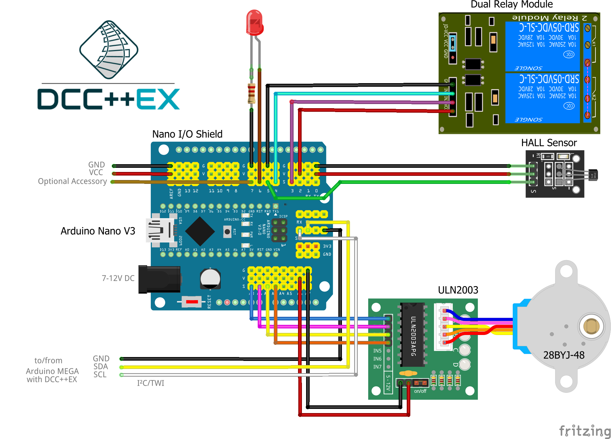{ width=400px }

Note: For the Tinkerers and Engineers, a much neater solution is to use a prototyping or strip board with much shorter (and soldered) connections to ensure reliability of the connections.

### Connection summary

Summary table of all connections required during assembly:

| Device Pin | Arduino Pin | Nano Shield Pin |
| ---------- | ----------- | --------------- |
| ULN2003 IN1 | A0 | A0 S |
| ULN2003 IN2 | A1 | A1 S |
| ULN2003 IN3 | A2 | A2 S |
| ULN2003 IN4 | A3 | A3 S |
| ULN2003 \+ | 5V | A0 V |
| ULN2003 \- | GND | A0 G |
| Hall effect \- (Left) | GND | 5 G |
| Hall effect Unmarked (middle) | 5V | 5 V |
| Hall effect S (Right) | 5 | 5 S |
| Dual relay VCC | 5V | 3 V |
| Dual relay GND | GND | 3 G |
| Dual relay IN1 | 3 | 3 S |
| Dual relay IN2 | 4 | 4 S |
| CommandStation 20 (SDA) | A4 | A4 S or SDA |
| CommandStation 21 (SCL) | A5 | A5 S or SCL |
| CommandStation GND | GND | A4 G or I2C (I<sup>2</sup>C) GND |

Of course for the Tinkerers and Engineers, if you're not using a Nano or a prototyping shield, adapt the details as suits your configuration.

#### Using a two wire stepper driver (e.g. A4988/DRV8825/TMC2208)

For those using a NEMA17 or similar stepper motor with a two wire type driver (e.g. A4988 or DRV8825), then the four Arduino pins A0 - A3 map like this, with the rest remaining the same as the table above:

| Device Pin | Arduino Pin | Nano Shield Pin |
| -- | -- | -- |
| A4988/DRV8825 Step pin | A0 | A0 S |
| A4988/DRV8825 Dir pin | A1 | A1 S |
| A4988/DRV8825 En pin | A2 | A2 S |
| N/A | A3 (not connected) | A3 S (not connected) |

**Note when using an A4988 stepper driver, you must connect the RESET (RST) and SLEEP (SLP) pins together.**

!!! note "utilising a two wire driver"

    When utilising a two wire driver such as the A4988, DRV8825, or TMC2208, you should adjust the current limiting value to suit your specific requirements. This typically requires measuring the voltage and adjusting a potentiometer on the driver board. A good guide on making this adjustment is at [circuitist.com](https://www.circuitist.com/how-to-set-driver-current-a4988-drv8825-tmc2208-tmc2209/).

Further to this, when using a stepper motor such as the NEMA17 with a two wire driver, you should also incorporate a 47uF electrolytic capacitor as physically close to the stepper driver motor power input as possible to protect from surges generated by the stepper motor.

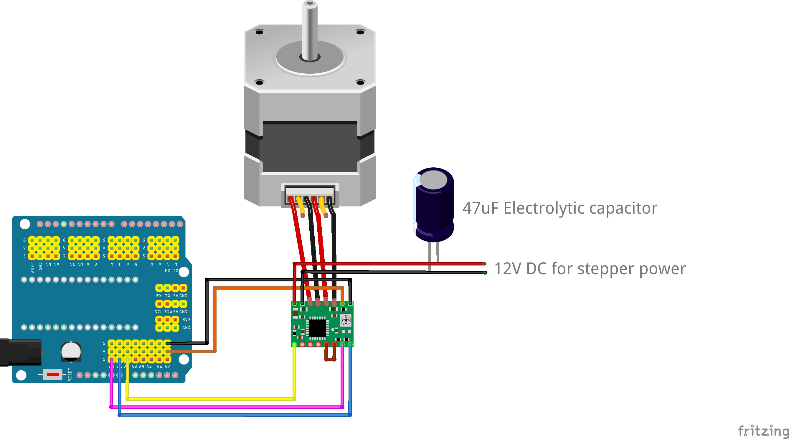{ width=400px }
<br/>Connections for an A4988 stepper driver with NEMA17 stepper motor

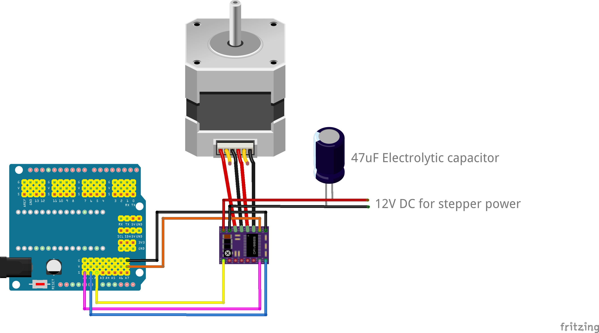{ width=400px }
<br/>Connections for a DRV8825 stepper driver with NEMA17 stepper motor

Credit to Dejan at HowToMechatronics.com for outlining the connections for a TMC2208 stepper driver with a NEMA17 stepper motor along with the microsteps table included below. Also note that with the TMC2208 driver, it typically rotates the stepper in the reverse direction to the A4988 and DRV8825, and likely requires inverting the DIR pin in order for it to rotate in the same direction. This is possible via a configuration option introduced in **EX-Turntable** version 0.7.0, see [invert_direction](configure.md#invert_direction).

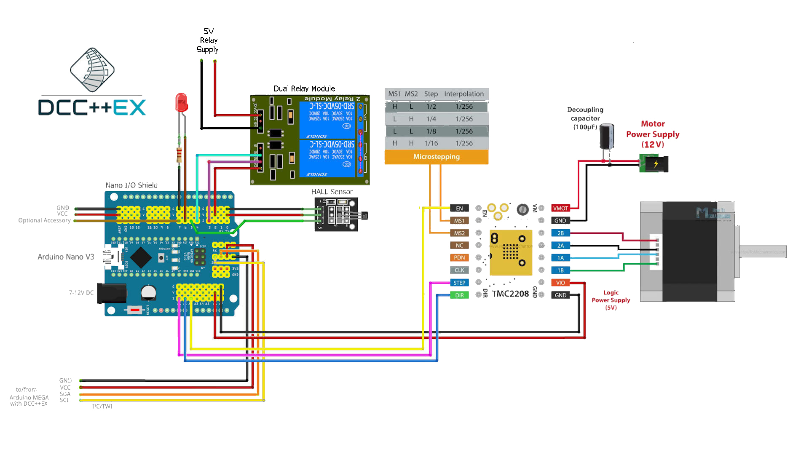{ width=400px }
<br/>Connections for a TMC2208 stepper driver with NEMA17 stepper motor

### 1. BEFORE you start

Gather all your components and visually check them all for any obvious damage, paying particular attention to pins on the Arduino to make sure they are straight.

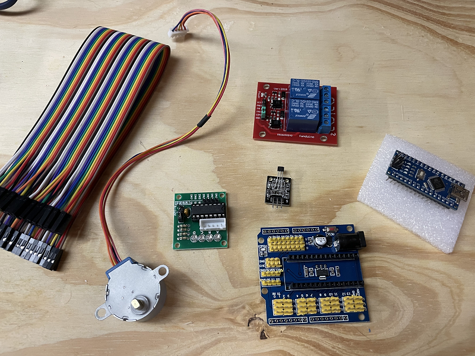{ width=400px }

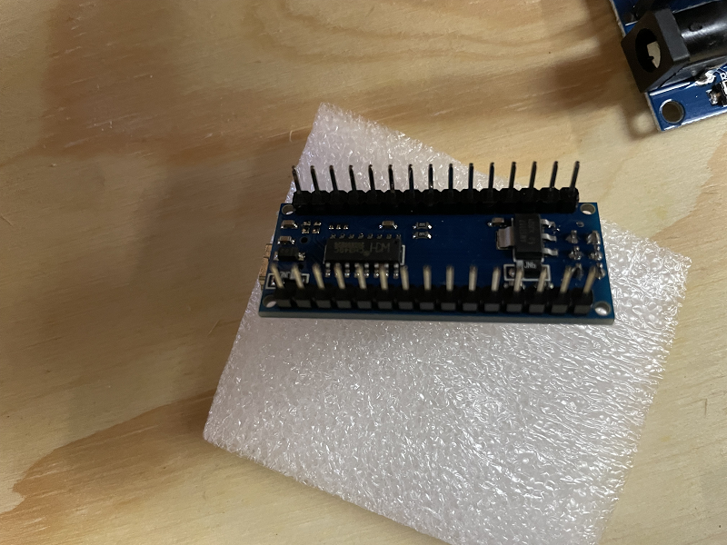{ width=400px }

### 2. Insert the Nano into the shield

Insert the Nano into the prototype shield socket, taking care to ensure the USB socket is located at the same end as the DC power jack, and that all pins are straight and aligned correctly with the female headers.

The various pin numbers may also be printed on the prototyping shield to confirm the correct orientation.

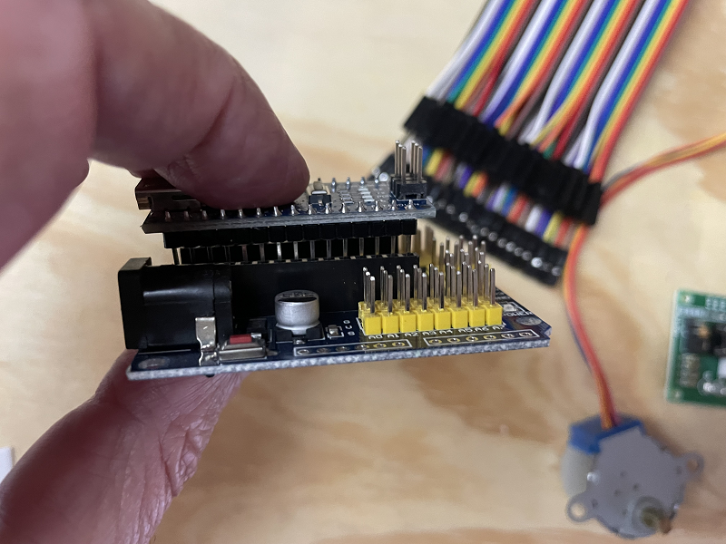{ width=400px }

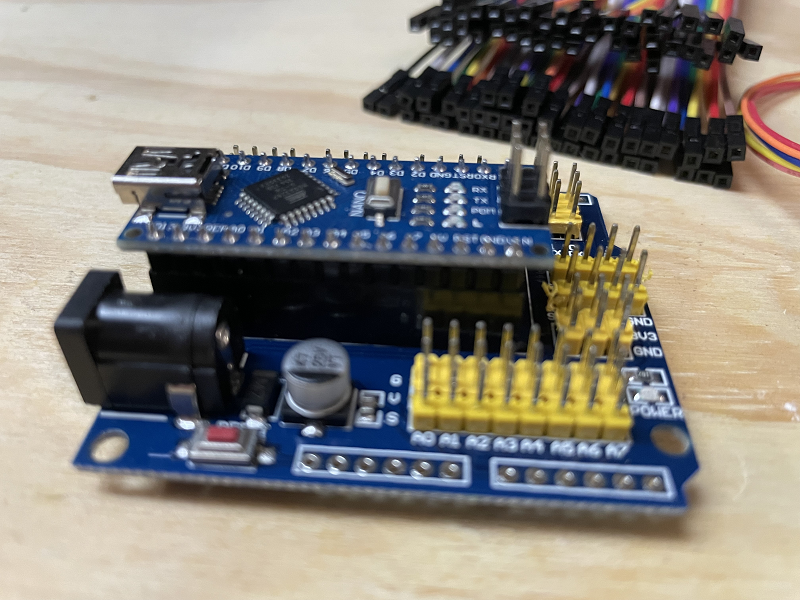{ width=400px }

At this point, it's a good idea to take careful note of the various pin markings on your prototype shield as it's critical that these are correct when connecting the various components.

With the shield used in these assembly photos, you will note that each of the Nano GPIO pins has three pins associated with it marked "G" for ground, "V" for 5V, and "S" for signal, with this last pin being the actual Nano GPIO pin.

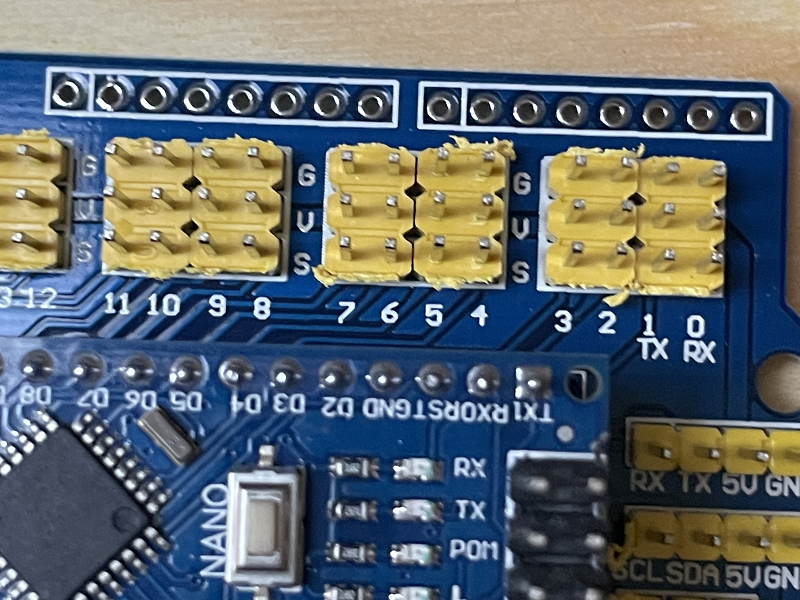{ width=400px }

### 3. Connect the stepper controller and motor

Firstly, note that the ULN2003 controller will have four pins marked "IN1" through "IN4", as well as a pair of pins with "+" and "-". There is a likely a jumper installed across two pins beside these that is unmarked, leave this in place.

You will need to connect six of the female to female Dupont wires from the ULN2003 pins to the Arduino prototype shield as below:

| ULN2003 Pin | Nano Shield Pin |
| -- | -- |
| IN1 | A0 S |
| IN2 | A1 S |
| IN3 | A2 S |
| IN4 | A3 S |
| \+ | A0 V |
| \- | A0 G |
  
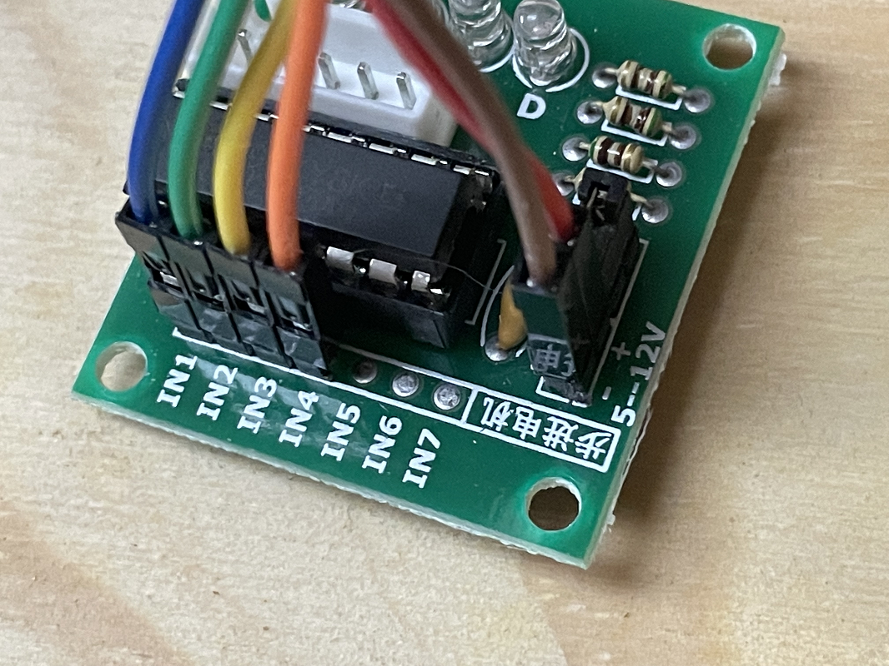{ width=400px }

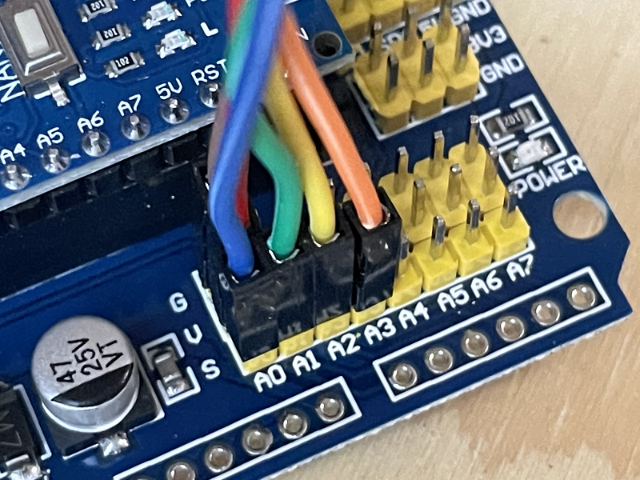{ width=400px }

Insert the stepper motor connector into the receptacle on the ULN2003 controller. Note that it will only go in one way, so check the orientation and simply plug it in.

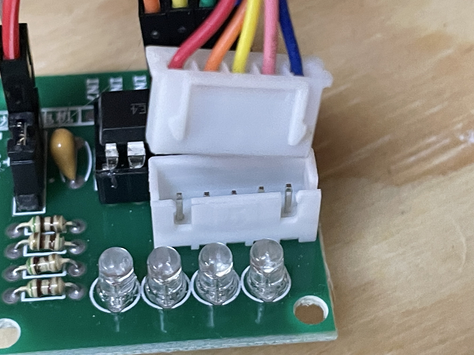{ width=400px }

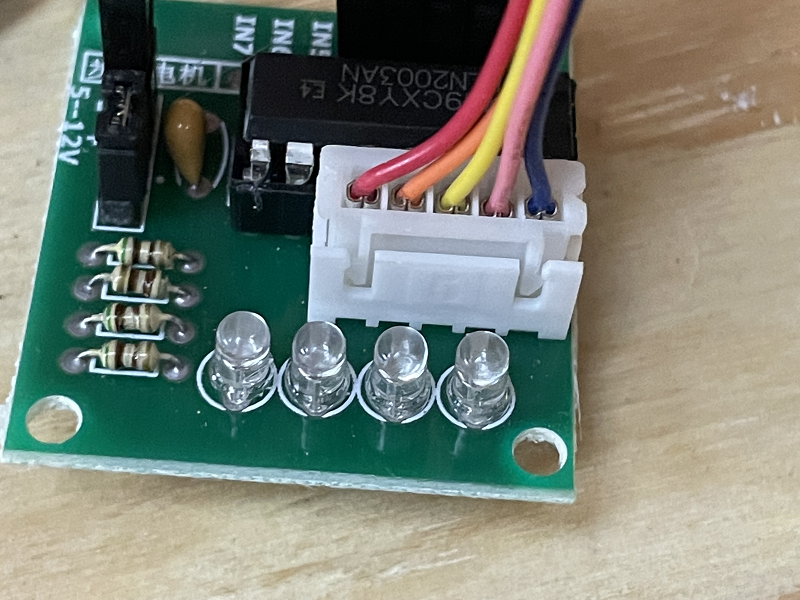{ width=400px }

### 4. Connect the hall effect sensor

The hall effect sensor has three pins, and likely only two of these pins are marked, the left with "-" and right with "S". The middle pin is likely to be unmarked, and will be the 5V pin. There are probably many different varieties of sensors and designs out there, but both that I have (from different suppliers) are marked identically.

Use three of the Dupont wires and connect these from the hall effect sensor to the Arduino prototype shield as below:

| Hall Effect Pin | Nano Shield Pin |
| -- | -- |
| \- (Left) | 5 G |
| Unmarked (middle) | 5 V |
| S (Right) | 5 S |

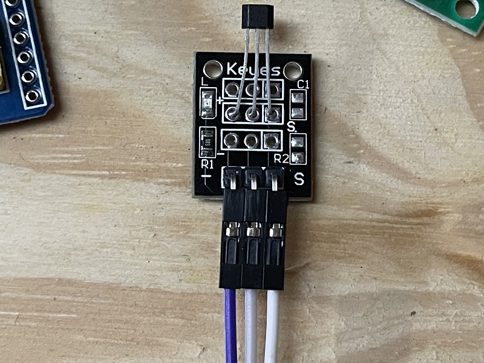{ width=400px }

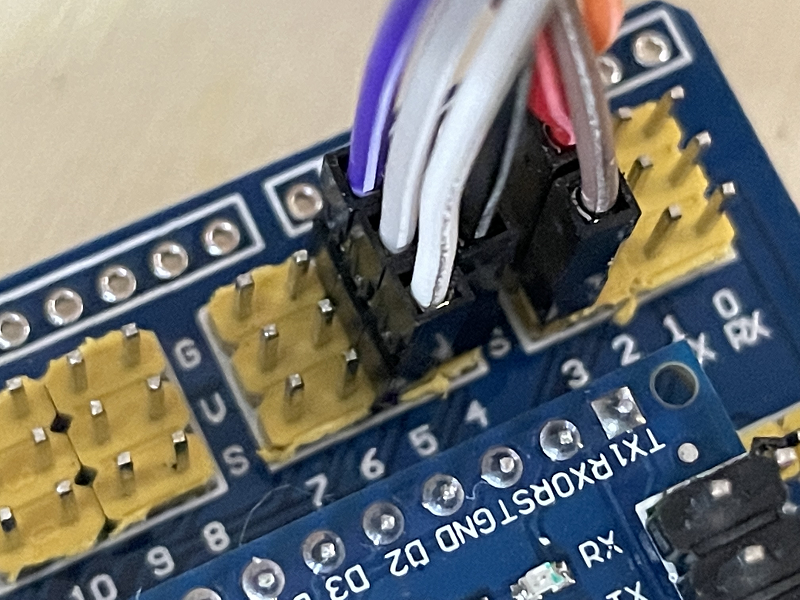{ width=400px }

### 5. Connect the dual relay board

Note there should be six pins on the dual relay board marked "VCC", "GND", "IN1", "IN2", "COM", and "GND". The "COM" and "GND" pins should have a jumper installed to connect these together. Leave this in place.

Use four Dupont wires to connect the other four pins as below:

| Dual Relay Pin | Nano Shield Pin |
| -- | -- |
| VCC | 3 V |
| GND | 3 G |
| IN1 | 3 S |
| IN2 | 4 S |

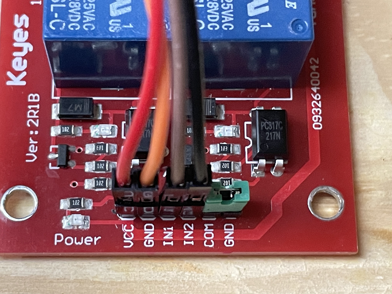{ width=400px }

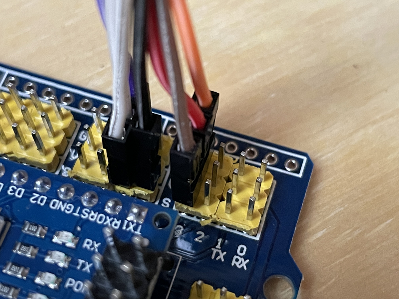{ width=400px }

### 6. Connect power and test

At this point, it should be safe to plug in the power supply to the DC power jack on the prototyping shield.

When the power supply is turned on, the power LEDs on the Arduino Nano and dual relay board should be lit. Note there is likely no power LED on the ULN2003 stepper controller, and testing of this will require loading the **EX-Turntable** software on to the Nano in step 7 below.

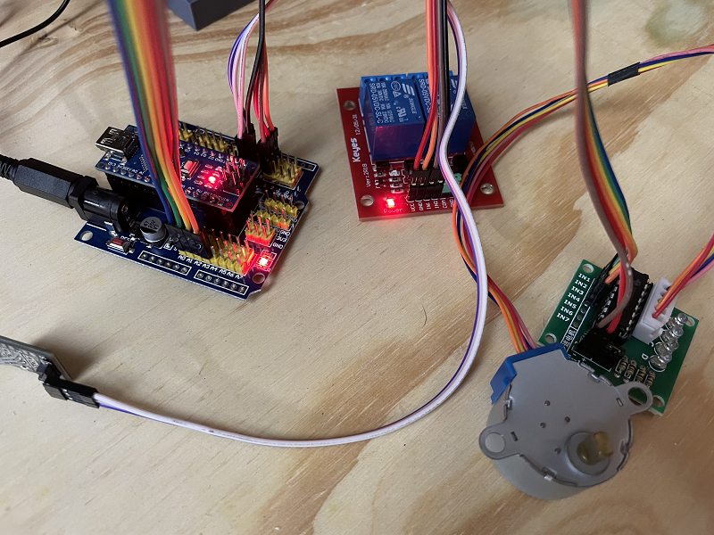{ width=400px }

To validate the hall effect sensor is connected correctly, put a magnet in close proximity (within a millimetre or so) of the sensor IC, and the onboard LED should light up.

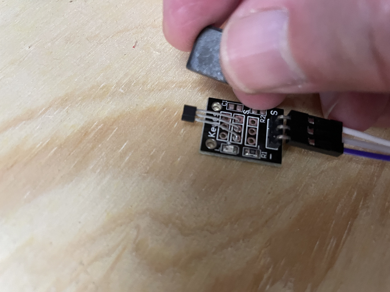{ width=400px }

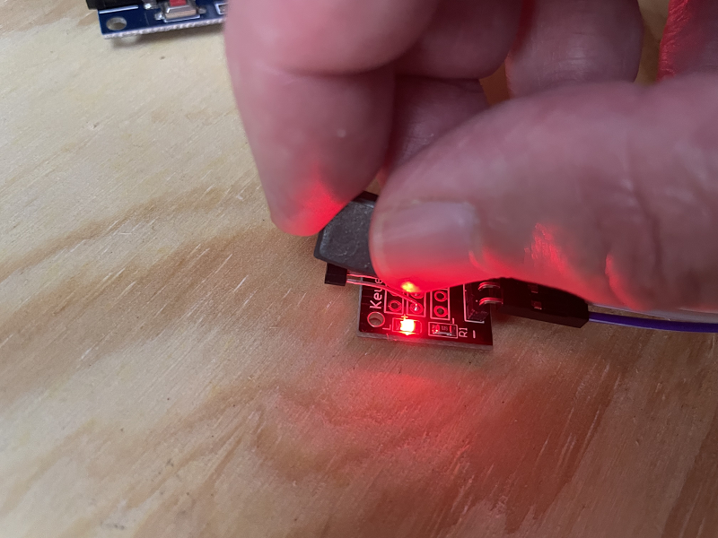{ width=400px }

### 7. Load the EX-Turntable software

!!! note "Tip"

    Please read through this entire section prior to loading any software onto your Arduino. It is also recommended that the turntable is able to trigger the homing sensor correctly to ensure the automatic calibration works correctly at first startup.

#### Installing with EX-Installer

**EX-Installer** can be used to install both **EX-CommandStation** and **EX-Turntable**. The process is the same for both, with the exception of the configuration options, therefore we will only outline the configuration options here. Refer to [EX-Installer](../../installer/installer.md) for the full documentation on using **EX-Installer**.

When you reach the "Select Product" screen, select **EX-Turntable**.

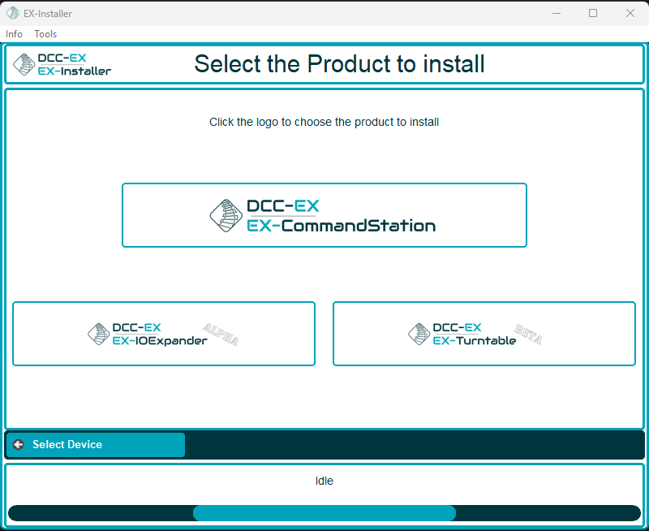{ width=400px }
<br/>EX-Installer - Product Screen

We always recommend selecting the latest available version for **EX-Turntable** unless advised otherwise, but note you will only see Development versions while it remains in Beta testing.

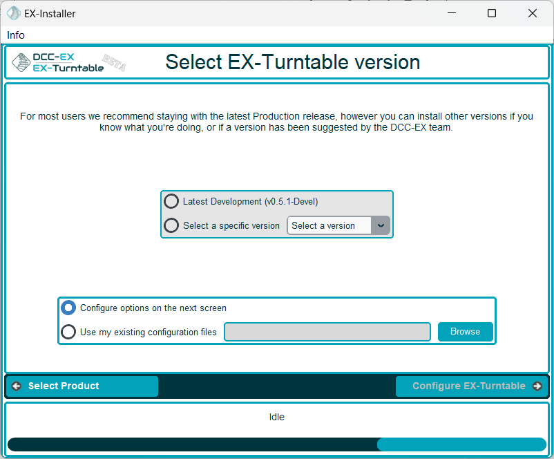{ width=400px }
<br/>EX-Installer - Product Screen

Once the version has been selected, you will be able to configure the necessary options.

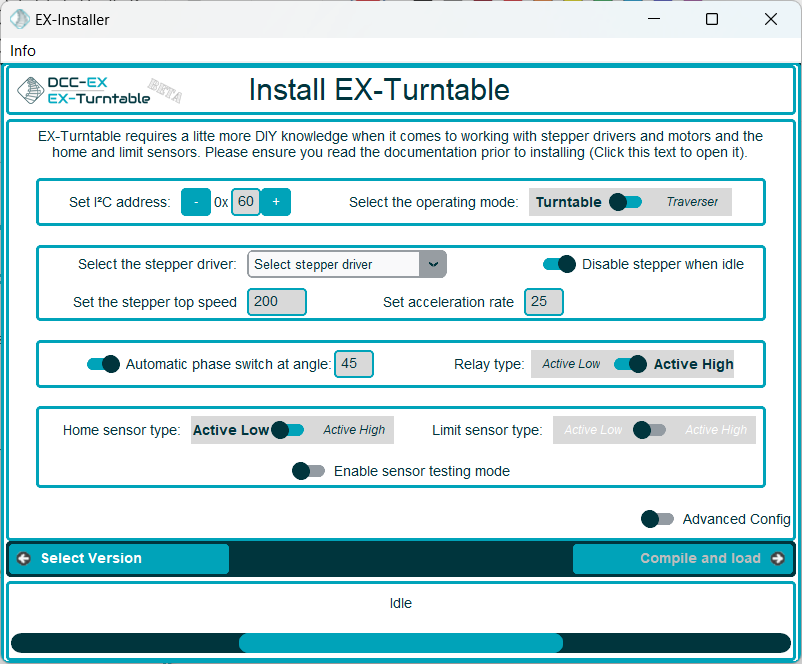{ width=400px }
<br/>EX-Installer - EX-Turntable configuration

If you have a need to configure any other settings, you can enable ``Advanced Config`` and edit the config file on the following page. You will need to do this if you intend to manually specify the steps per rotation for the stepper.

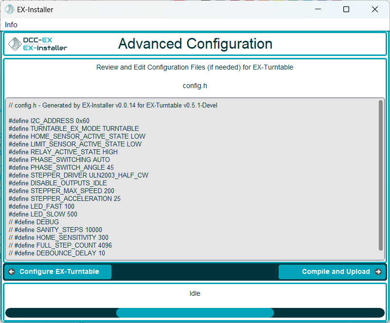{ width=400px }
<br/>EX-Installer - EX-Turntable Advanced Config

Continue through the rest of the **EX-Installer** process to load the software on to your device, then skip to [first start and automatic calibration](assembly.md#first-start-and-automatic-calibration) to continue.

#### Installing with the Arduino IDE

Further to this, note that you will need to end up with two separate folders; one containing the **EX-CommandStation** software as per  ==TODO== :doc:`/ex-commandstation/advanced-setup/installation-options/arduino-ide`, and an additional folder containing the **EX-Turntable** software. The **EX-Turntable** software is not a component of **EX-CommandStation** or vice versa, and as such they should not exist in the same folder.

We recommend using **EX-Installer** to install **EX-Turntable** as outlined above, however you can use the Arduino IDE to load the software onto the Arduino manually.

As noted in the tip above, you should have a **EX-Turntable** folder alongside the **EX-CommandStation** folder, and neither should reside in the other (the **EX-Turntable** software is required in the next step):

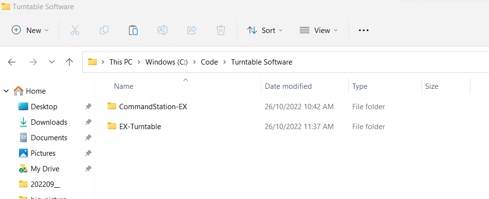{ width=400px }

The process here is the same as installing CommandStation-EX via the Arduino IDE which you can find on the ==TODO== :doc:`/ex-commandstation/advanced-setup/installation-options/arduino-ide` page.

When you get to the point of opening the sketch, ensure you open the EX-Turntable sketch:

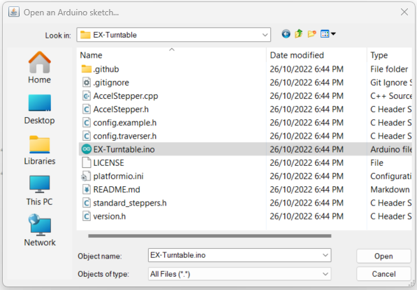{ width=400px }

Use Windows Explorer to either copy or rename "config.example.h" to "config.h".

If you need to make adjustments to config.h, refer to the [configure](configure.md) page.

Set the board type to "Nano" and set the correct Processor type (typically ATMega328P):

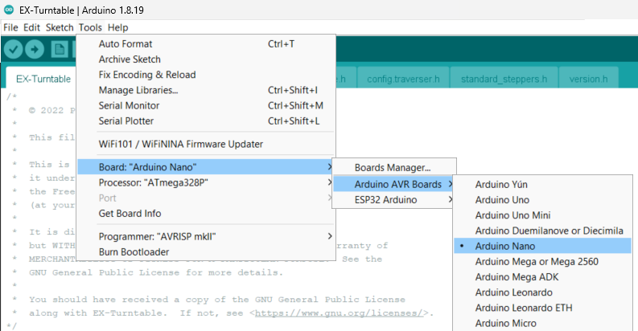{ width=400px }

After any adjustments are made and "config.h" has been created, the software can be uploaded to the Arduino with the upload button:

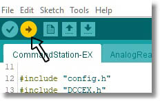{ width=400px }

Once the software is loaded successfully on to **EX-Turntable**, the stepper motor should automatically start rotating in an attempt to find its "home" position, which will be activated when the magnet at one end of the turntable comes in close proximity to the hall effect sensor.

If you don't have the magnet installed at this point, or if it is too far from the sensor, **EX-Turntable** will rotate several turns prior to flagging that homing has failed, and will then cease turning. The automatic calibration process will not commence if homing has failed.

If your testing of the hall effect sensor in step 6 above succeeded, then the issue is likely to be the distance the magnet is from the sensor, and this will require adjustment. See [EX-Turntable troubleshooting](ex-tt-troubleshooting.md) for further assistance if required.

#### Configuration for two wire stepper drivers (e.g. A4988/DRV8825)

If using a two wire stepper driver such as the A4988 or DRV8825 with a bipolar stepper motor such as a NEMA17 or similar, you will need to update "config.h" to reflect this.

While the provided "config.example.h" file includes instructions, they are repeated here for clarity, as well as being outlined on the [configure](configure.md) page.

Locate this section in "config.h", comment out the line defining the use of "ULN2003_HALF_CW" by adding ``//``, and uncomment the line defining the use of "A4988" by removing ``//``:

```cpp
  /////////////////////////////////////////////////////////////////////////////////////
  //  Define the stepper controller in use according to those available below, refer to the
  //  documentation for further details on which to select for your application.
  // 
  //  ULN2003_HALF_CW     : ULN2003 in half step mode, clockwise homing/calibration
  //  ULN2003_HALF_CCW    : ULN2003 in half step mode, counter clockwise homing/calibration
  //  ULN2003_FULL_CW     : ULN2003 in full step mode, clockwise homing/calibration
  //  ULN2003_FULL_CCW    : ULN2003 in full step mode, counter clockwise homing/calibration
  //  A4988               : Two wire drivers (e.g. A4988, DRV8825)
  //  A4988_INV           : Two wire drivers (e.g. A4988, DRV8825), with enable pin inverted
  // 
  //  NOTE: If you are using a different controller than those already defined, refer to
  //  the documentation to define the appropriate configuration variables. Note there are
  //  some controllers that are pin-compatible with an existing defined controller, and
  //  in those instances, no custom configuration would be required.
  // 
  // #define STEPPER_DRIVER ULN2003_HALF_CW
  // #define STEPPER_DRIVER ULN2003_HALF_CCW
  // #define STEPPER_DRIVER ULN2003_FULL_CW
  // #define STEPPER_DRIVER ULN2003_FULL_CCW
  #define STEPPER_DRIVER A4988
  // #define STEPPER_DRIVER A4988_INV   <--- Versions before 0.7.0
  // #define INVERT_STEP                <--- Version 0.7.0 on
```

!!! note "EX-Turntable does not disable the stepper driver"

    If operating EX-Turntable does not disable the stepper driver after movements complete, you will likely hear a buzzing or humming from the driver. In this instance, you may find you need to have the "Enable" pin inverted. In versions prior to 0.7.0, you will need to use the "A4988_INV" option instead (``#define STEPPER_DRIVER A4988_INV``), and from version 0.7.0, you will need to enable the "INVERT_ENABLE" option (``#define INVERT_ENABLE``).

#### First start and automatic calibration

!!! note "automatic calibration"

    If you have loaded the code too soon, and the automatic calibration has succeeded and recorded an inaccurate step count, then have no fear as there is a command you can run on the CommandStation to reinitiate the calibration sequence which is outlined in the [testing](test-and-tune.md#testing-ex-turntable) section.

  As of v0.5.0-Beta and up to version 0.6.0, you can also execute the command ``<0 3>`` in the serial console to initiate the calibration sequence. In version 0.7.0 you can execute ``<C>`` instead to initiate the sequence.

  Also, if you have enabled the `FULL_STEP_COUNT` option in "config.h", that will prevent automatic calibration occurring, refer to [full step count](configure.md#full_step_count).

When **EX-Turntable** is first loaded onto your Arduino, and it has successfully performed the homing process outlined above, it will commence an automatic calibration sequence. This involves several rotations of the turntable to ensure it is homed accurately, and is then able to count the steps required to complete a full rotation of the turntable.

Once the calibration sequence has completed, it will display the step count for an entire rotation, which you should take note of for calculating the various positions in [tuning your turntable positions](test-and-tune.md#tuning-your-turntable-positions).

On the first start, the output in the serial console should look similar to the below:

```cpp
  License GPLv3 fsf.org (c) dcc-ex.com
  EX-Turntable version 0.5.0-Beta
  Available at I2C address 0x60
  EX-Turntable in TURNTABLE mode
  EX-Turntable has not been calibrated yet
  Automatic phase switching enabled at 45 degrees
  Phase will switch at 0 steps from home, and revert at 0 steps from home
  Calibrating...
  Homing started
  Turntable homed successfully
  CALIBRATION: Phase 1, homing...
  CALIBRATION: Phase 2, counting full turn steps...
  CALIBRATION: Completed, storing full turn step count: 4100                    <<== This is the full turn step count to record for later reference
  EX-Turntable has been calibrated for 4100 steps per revolution
  Automatic phase switching enabled at 45 degrees
  Phase will switch at 495 steps from home, and revert at 2475 steps from home
  Turntable homed successfully
```

At this point, the full turn step count is written to the Arduino's EEPROM so that it can be retrieved each time **EX-Turntable** starts up, preventing the need to repeat the calibration sequence at each subsequent start.

You can now safely power off **EX-Turntable** and remove the USB cable from your PC as it is no longer required for normal operation, and all further commands will be issued by the CommandStation.

### 8. Add the EX-Turntable device driver to EX-CommandStation

#### Add with EX-Installer

If you are using **EX-Installer** to load software, you can add your **EX-Turntable** device and routes on the Advanced Configuration screen by adding them to your myAutomation.h file.

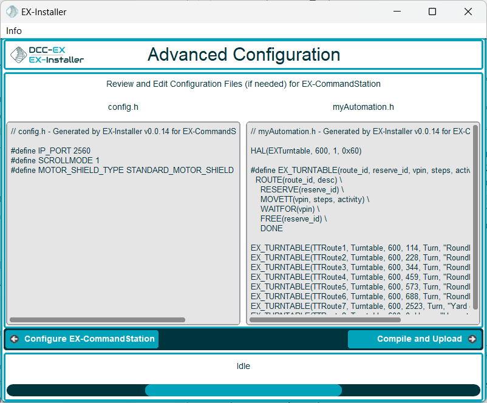{ width=400px }
<br/>EX-Installer - Add EX-Turntable support in myAutomation.h

#### Add manually

!!! note "EX-CommandStation version 5.0.0 or later"

    As mentioned previously, your CommandStation needs to be running **EX-CommandStation** version 5.0.0 or later (preferably at least 5.4.0).

    If you receive compile errors that the file "IO_EXTurntable.h" is missing when attempting to upload the CommandStation software later in this process, this indicates you are using the incorrect version of **EX-CommandStation**.

    Previous versions of this documentation referred to editing "myHal.cpp". While this is possible, the recommended method is to define your device in "myAutomation.h" instead.

Before you will be able to test or use **EX-Turntable**, you need to configure the **EX-CommandStation** software to load the appropriate device driver.

This requires creating or editing the myAutomation.h file in the **EX-CommandStation** code and uploading it to your CommandStation.

```cpp
  HAL(EXTurntable, 600, 1, 0x60)  // Create the device
```

In the device setup above, there are three parameters provided, but only two may need to change in your environment if you have other devices that may conflict with these two settings:

- VPIN=600 - This is the default virtual pin (Vpin) ID that is used to send **EX-Turntable** commands to. Vpin IDs need to be unique, so if this ID is used elsewhere, change as necessary (refer ==TODO== :ref:`reference/developers/hal:overview`).
- I2C (I<sup>2</sup>C) address=0x60 - This is the default address on the I2C (I<sup>2</sup>C) bus that the **EX-Turntable** is configured to use. This address also needs to be unique, so change this also if it is in use elsewhere, both in "myAutomation.h" and in "config.h" in the **EX-Turntable** software.

If you already have an existing "myAutomation.h" file, then you simply need to add this entry in the appropriate section of your existing file.

Follow the rest of the directions for ==TODO== :ref:`reference/developers/hal-config:adding a new device` all the way through to the ==TODO== :ref:`reference/developers/hal-config:upload the new version of the software` step to upload your newly configured CommandStation.

### 9. Connect EX-Turntable to your EX-CommandStation

To control **EX-Turntable** from your CommandStation, you will need a connection to the I2C (I<sup>2</sup>C) (SDA, SCL) pins.

!!! warninf "Danger"

    Ensure you turn the power off to both your CommandStation and **EX-Turntable** prior to making any of these connections.

On the CommandStation, assuming this is a Mega2560 or Mega2560 + WiFi, the SDA (pin 20) and SCL (pin 21) pins are typically labelled as such, so should be easy to identify.

On an Arduino Nano (and Uno) however, the SDA and SCL pins are shared with analog pins A4 and A5, and therefore aren't explicitly labelled. The SDA pin is A4, and the SCL pin is A5.

Connect these pins to your CommandStation as shown in the table below, noting that it is important to ensure the ground is also connected to ensure the I2C (I<sup>2</sup>C) communication is reliable.

| CommandStation Pin | Nano Shield Pin |
| -- | -- |
| 20 (SDA) | A4 S (SDA) |
| 21 (SCL) | A5 S (SCL) |
| Any spare ground | A4 G |
  
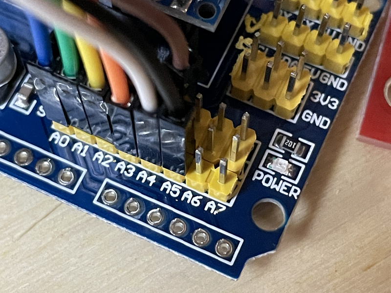{ width=400px }

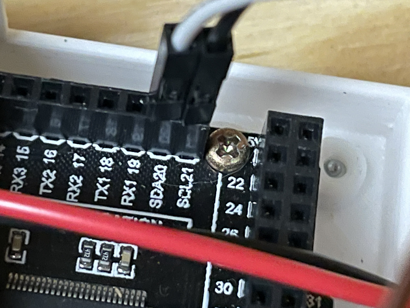{ width=400px }

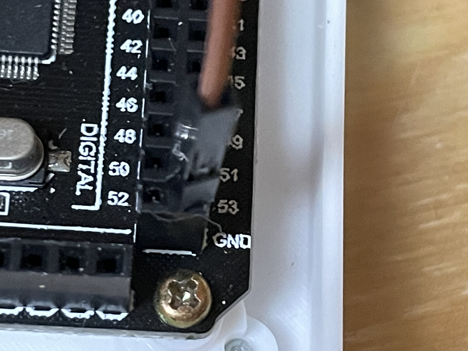{ width=400px }

## Now you're ready

At this point, you should have a fully assembled **EX-Turntable** with the software loaded, a default configuration, and the device driver installed and configured in your CommandStation.

In addition, **EX-Turntable** should be connected to your CommandStation ready to test, tune your turntable positions, and configure EXRAIL ready for use on your layout.

Click the 'Next' button to get cracking!
