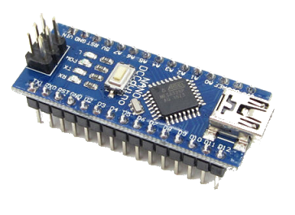
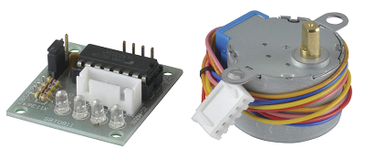
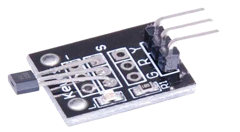
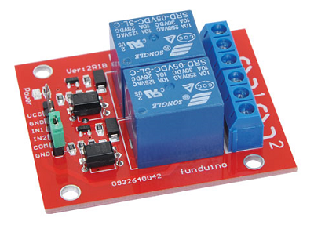
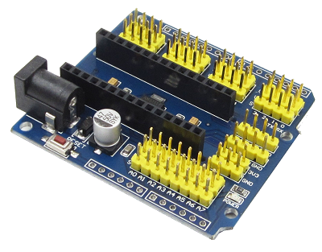
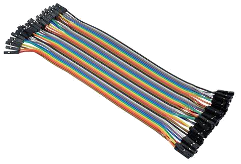

# Purchasing

## What you need for EX-Turntable

* An **EX-CommandStation** running version 5.0.0 or later (preferably at least 5.4.0)
* An Arduino microcontroller (tested on Nano V3, both old and new bootloader, and an Uno R3 should also work)
* A supported stepper motor driver and stepper motor (see list below)
* A hall effect (or similar) sensor for homing, which needs to be digital/unipolar such as an A3144 or 44E (or equivalent), and a HC-020K optical sensor is also an appropriate alternative here
* A suitable power supply - note that your chosen stepper driver/motor will dictate this, see note below
* A prototyping shield is highly recommended, especially when using a Nano, and the pictured version is preferred over the screw terminal version
* Dupont type wires to connect the components, male to female or female to female as required
* A USB cable to connect the Arduino to a PC to load the software
* *Optional:* A dual relay board (or similar) if you wish to use the phase switching capability (see [phase (or polarity) switching](overview.md#important-phase-or-polarity-switching))

!!! warning "using the UNL2003/28BYJ-48 stepper driver"

    Both this and the following assembly page are primarily about using the UNL2003/28BYJ-48 stepper driver and motor combination. While these are inexpensive and easy to obtain, there have been many reports of these having various quality issues, primarily relating to "slop" in the gear mechanism of the stepper motor.

    As a result, we highly recommend using a NEMA17 and two wire stepper driver such as the A4988, DRV8825, or TMC2208 instead. The instructions on these pages are largely the same, with some changes to the wiring connections required as outlined in [using a two wire stepper driver](assembly.md#using-a-two-wire-stepper-driver-eg-a4988drv8825tmc2208)`.

    If you do continue to use a ULN2003/28BYJ-48 combination and have issues with accuracy, consider enforcing single direction rotation to help mitigate this by enabling either the [rotate forward only](configure.md#rotate_forward_only) or [rotate reverse only](configure.md#rotate_reverse_only) configuration setting.

  As time allows, we will update the images and instructions to focus on this new recommendation.

!!! note "traverser feature"

    If you wish to make use of the traverser feature, there is further information on what is required to enable this on the [Traverser](traverser.md) page.

{ width=400px }

{ width=400px }

{ width=400px }

{ width=400px }

{ width=400px }

{ width=400px }

### Power supplies

Choosing the right power supply for your Arduino and stepper motor is important to get right.

If you are using the default ULN2003/28BYJ-48 it is technically possible to power the driver and stepper directly from the 5V output on an Arduino, however this is **not recommended** and should be avoided.

Given that this combo requires 5V, you can use a single, regulated 5V DC power supply rated for at least 500mA to power both the Arduino and the ULN2003/28BYJ-48.

Note that if you use the right Arduino Nano prototyping shield, it will likely have a LM317 voltage regulator supplied by the DC power jack. In this instance, you can use a 7 to 9V 500mA+ DC power supply to provide power, and it will be safe to connect the ULN2003 5V to a 5V output on the prototyping shield.

For other steppers such as the NEMA17 that require 12v DC, you will need either two separate power supplies, or a DC-DC converter to provide a lower voltage to the Arduino. Note that the NEMA17 steppers have a considerably higher current rating, so the power supply will need to be rated at 1.5A or higher.

## Supported stepper drivers and motors

The default configuration of **EX-Turntable** is for the ubiquitous ULN2003/28BYJ-48 stepper driver and motor combination.

!!! note "Unsupported stepper drivers and motors"

    If you have a need to use a different driver, these should be relatively straight forward to configure in a similar manner to how additional motor drivers are configured for use with CommandStation-EX.

    Refer to [defining custom stepper drivers](configure.md#defining-custom-stepper-drivers) for more details.

However, it is very easy to use one of several other common stepper drivers if you require more torque, or if you prefer to use a NEMA17 or other stepper motor.

The complete list of supported stepper drivers and motors:

* ULN2003/28BYJ-48 (Default)
* A4988/NEMA17
* DRV8825/NEMA17
* TMC2208/NEMA17

----

## Next Steps

Now that you know what you need, click the 'Next' button see what is needed to create an **EX-Turntable**.

--8<-- "snippets/abbr.md"
