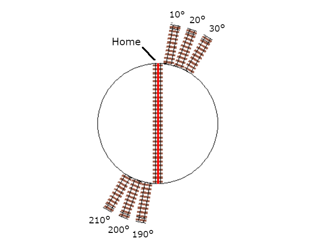

# Testing, Tuning, and Control

## Testing EX-Turntable

Before attempting to configure your **EX-Turntable** in the **EX-CommandStation** software, it is recommended to perform some initial testing to make sure it functions as it should.

Once you have performed this testing, you will be familiar with the commands that will help you tune the steps required to achieve proper track alignment between your turntable bridge and the surrounding tracks, and can then configure **EX-CommandStation** to operate **EX-Turntable** reliably.

It is recommended to perform testing via the **EX-Turntable** serial console first using the commands in the next section, and then test using the **EX-CommandStation** diagnostic command. Using the diagnostic command is also the recommended method to perform tuning, as it replicates what the turntable object (and/or **EXRAIL**) will use to operate the turntable.

!!! note "Important"

    For all references to 'steps', this is the number of steps from the home position, not the number of steps the turntable has to travel.

### EX-Turntable interactive serial console commands

While the ability to test **EX-Turntable** directly via the serial console was introduced in 0.5.0, this section covers the commands as of version 0.7.0. We highly recommend updating the **EX-Turntable** software if you are not running the latest. **Note** that this command is available when connected to the **EX-Turntable** serial console, **not** the **EX-CommandStation** serial console.

These are the interactive serial console commands available:

- ``<C>`` - Initiate the calibration sequence
- ``<D>`` - Enable/disable debug output to the serial console
- ``<E>`` - Erase the EEPROM contents, which will force calibration to occur at next startup
- ``<H>`` - Initiate homing
- ``<M steps activity>`` - Initiate a move to the provided step count with the specified activity
- ``<R>`` - Initiate a reboot (note with the old bootloader Nano this will not function correctly)
- ``<T>`` - Enter/exit sensor testing mode, and requires a restart if exiting
- ``<V>`` - Display the startup information in the serial console

To test your **EX-Turntable** is functional, use the command ``<M steps activity>``.

For example, sending the command ``<M 300 0>`` via the serial console will result in output similar to this:

```cpp
  Received serial input: 300 0
  Test move 300 steps, activity ID 0
  Received notification to move to step postion 300
  Position steps: 300, Auto phase switch - moving 300 steps
  Setting phase switch flag to: 0
```

If you are seeing unexpected results, use the ``<V>`` command to show the startup information which will display the calibrated full turn step count to validate calibration worked as expected. If the step count is unexpected, use the ``<C>`` command to force calibration to run again.

Further information on the "activity" parameter is outlined in the [ex-turntable activity reference](test-and-tune.md#ex-turntable-activity-reference) section.

### Testing with the EX-CommandStation diagnostic command

Once you have verified **EX-Turntable** is functioning as expected, move on to testing with the **EX-CommandStation** diagnostic command ``<D TT vpin steps activity>``.

Ensure **EX-Turntable** was powered on before **EX-CommandStation**. By powering these on in that order, you will ensure that **EX-Turntable** is available prior to the CommandStation trying to load the device driver, otherwise it will consider the device as "OFFLINE", and commands will fail.

**Note** that these commands are available when connected to the **EX-CommandStation** serial console, **not** the **EX-Turntable** serial console.

Referring to [adding a new device](/reference/hardware/hal/hal-config.md#adding-a-new-device), skip ahead to ==TODO== [checking the driver](/reference/hardware/hal/hal-config.md#checking-the-driver), and the output you're looking for to validate the **EX-Turntable** device driver is loaded and connected successfully is below:

```cpp
  <D HAL SHOW><* Arduino Vpins:2-69 *>
  <* PCA9685 I2C:x40 Configured on Vpins:100-115  *>
  <* PCA9685 I2C:x41 Configured on Vpins:116-131 OFFLINE *>
  <* MCP23017 I2C:x20 Configured on Vpins:164-179 OFFLINE *>
  <* MCP23017 I2C:x21 Configured on Vpins:180-195 OFFLINE *>
  <* EX-Turntable I2C:x60 Configured on Vpins:600-600  *>          <<== This is the important line, **EX-Turntable** is connected!
```

If there is an "OFFLINE" at the end of the **EX-Turntable** line, it indicates something is not quite right. Refer to [showing as offline with `<d hal show>`](ex-tt-troubleshooting.md#ex-turntable-showing-as-offline-with-d-hal-show).

At power on, note that the turntable should have moved itself to the home position, so all commands below assume this is the case.

!!! note "default option for automatic phase switching"

    For all testing and tuning below, it is assumed that the default option for automatic phase switching is enabled, and that the default ULN2003/28BYJ-48 stepper driver and motor combination is in use in half step mode, which is ~4096 steps per revolution.

    For automatic phase switching, this should translate to ~512 steps for the 45 degree phase switch trigger point, and ~2560 steps for the 225 degree revert trigger point.

This command should rotate the turntable 100 steps only:

```cpp
  <D TT 600 100 0>
```

This command should rotate the turntable a further 500 steps and active the phase inversion relays:

- 500 is the difference between the existing 100 steps and target 600 steps
- 600 steps is greater than the ~512 step/45 degree trigger position for phase inversion

```cpp
  <D TT 600 600 0>
```

This next command should rotate the turntable in the reverse direction by 300 steps and deactivate the phase inversion relays:

- 300 is the difference between the existing 600 steps and target 300 steps, with the reverse direction being the shortest path there
- 300 steps is less than the ~512 step/45 degree trigger position for phase inversion

```cpp
  <D TT 600 300 0>
```

This command should rotate the turntable again in the reverse direction, and should also activate the phase inversion relays:

- 2000 steps is greater than the ~512 step/45 degree trigger position for phase inversion
- It is also less than the ~2560 step/225 degree trigger position to revert the inversion

```cpp
  <D TT 600 2000 1>
```

Finally, this command will cause the turntable to once again find its home position:

```cpp
  <D TT 600 0 2>
```

Providing these tests have completed successfully, you are now ready to tune the turntable positions for your layout and configure your **EX-Turntable** ready for operation.

Further information on the "activity" parameter is outlined in the [ex-turntable activity reference](test-and-tune.md#ex-turntable-activity-reference) section.

## Tuning your turntable positions

!!! note "Tip"

    To determine your starting positions, you will need the full turn step count as recorded in [first start and automatic calibration](assembly.md#first-start-and-automatic-calibration).

To tune your turntable positions, you will need to calculate the number of steps from the home position the turntable needs to rotate in order to reach the desired position. By default, the turntable will turn in a clockwise direction (as demonstrated by the homing activity).

### Determine the positions

At this point, you should either have a layout you're fitting **EX-Turntable** into, or a layout design that you're working to, with the various turntable connection tracks defined.

The simplest way to devise the approximate number of steps for each turntable position is to calculate these based on the degrees each step will turn.

For the default **EX-Turntable** configuration with the ULN2003/28BYJ-48 stepper driver/motor combo in half step mode, this should give a step count close to 4096 for a single 360 degree rotation, which means each step is ~0.088 degrees of movement (360/4096 = 0.088).

Therefore, to determine the number of steps required to turn a certain number of degrees, use the formula "steps = degrees/degrees per step". To turn 10 degrees requires ~114 steps (10 / 0.088 = 113.64).

In this example, for simplicity, we will devise the steps required for a six position turntable, with position 1 being 10 degrees from the home position, position 2 a further 10 degrees, position 3 a further 10 degrees again, and positions 4 through 6 being 180 degrees from the first three positions.

{ width=400px }

Therefore, using our formula, the starting point for each position will be:

| Position | Degrees from home | Steps from home |
| -- | -- | -- |
| 1 | 10 | 114 |
| 2 | 20 | 227 |
| 3 | 30 | 341 |
| 4 | 190 | 2159 |
| 5 | 200 | 2273 |
| 6 | 210 | 2386 |

### Example tuning commands

To validate the above calculated positions, the following six diagnostic commands should be executed in the serial terminal of the CommandStation, which will allow you to visually inspect the alignment with your layout tracks and adjust accordingly:

```cpp
  <D TT 600 114 0>
  <D TT 600 227 0>
  <D TT 600 341 0>
  <D TT 600 2159 0>
  <D TT 600 2273 0>
  <D TT 600 2386 0>
```

If you find any of these positions are slightly out of alignment, simply adjust the step count as appropriate to compensate.

Note that due to the automatic phase inversion, the last three positions will automatically active the phase inversion relays due to being within the 45 to 225 degree angles that activates phase inversion.

### Apply to your layout

At this point, you should be able to apply the above calculations to your own layout and come up with the step count required for each position.

Use appropriate diagnostic commands to test and tune each position for that perfect alignment, and providing your layout is functional, you should be able to drive a locomotive on and off your turntable in each position.

## Configuring your turntable

As mentioned previously, we recommend using **EX-CommandStation** version 5.4.0 or later to make use of the new turntable object along with the new **EXRAIL** commands.

Note that the previous **EXRAIL** commands are still valid and will work, however all examples on this page have been updated to reflect the new commands.

For full details on using the new commands available, refer to ==TODO== :ref:`reference/software/command-summary-consolidated:turntables/traversers (configuring the ex-commandstation)` and :ref:`reference/software/command-summary-consolidated:turntables/traversers`, and also the **EXRAIL** commands in :ref:`exrail/exrail-command-reference:turntable/traverser objects - definition and control` and :ref:`exrail/exrail-command-reference:turntable features`.

For simplicity, the examples below use the same step counts as calculated in the tuning section above.

### Basic DCC-EX native turntable definition and control

In this example, a turntable with ID 1 is defined with our six positions as per the tuning examples, and disregarding the values of **home** and **angle**.

```cpp
  <I 1 EXTT 600 0>
  <I 1 ADD 1 114 0>
  <I 1 ADD 2 227 0>
  <I 1 ADD 3 341 0>
  <I 1 ADD 4 2159 0>
  <I 1 ADD 5 2273 0>
  <I 1 ADD 6 2386 0>
```

Assuming **EX-Turntable** was configured for automatic phase switching, these commands would be used to rotate it to position 1, then position 6, and then home:

```cpp
  <I 600 1 0>
  <I 600 6 0>
  <I 600 0 2>
```

#### Operation with manual phase switching

For the same scenario, but with manual phase switching, these commands would be used:

```cpp
  <I 600 1 0>
  <I 600 6 1>
  <I 600 0 2>
```

### EXRAIL definition and control

The real beauty of this new object comes in the form of automation possibilities with **EXRAIL**, as there is now an event handler ``ONROTATE()`` along with a position test command ``IF_TTPOSITION()`` and a new ``WAITFORTT()`` command to really enhance the possibilities of what can be accomplished when turntable/traverser activities occur.

To define our turntable as above but in **EXRAIL**, it looks like this:

```cpp
  HAL(EXTurntable,600,1,0x60)
  EXTT_TURNTABLE(1,600,0,"My EX-Turntable")
  TT_ADDPOSITION(1,1,114,0,"Roundhouse stall 1")
  TT_ADDPOSITION(1,2,227,0,"Roundhouse stall 2")
  TT_ADDPOSITION(1,3,341,0,"Roundhouse stall 3")
  TT_ADDPOSITION(1,4,2159,0,"Reverse to stall 1")
  TT_ADDPOSITION(1,5,2273,0,"Reverse to stall 2")
  TT_ADDPOSITION(1,6,2386,0,"Reverse to stall 3")
```

Now, suppose we wish to turn a flashing light connected to Vpin 164 on whenever the turntable is is motion. This can be accomplished with our event handler:

```cpp
  ONROTATE(1)
    SET(164)
    WAITFORTT(1)
    RESET(164)
  DONE
```

This can be further enhanced with position specific options. Say we have roundhouse doors that need to be opened when their position is selected, and closed after the loco has entered the stall.

Stall 1's door is operated by enabling Vpin 164, 2 by Vpin 165, and 3 by Vpin 166. Sensors for each are at Vpins 167, 168, and 169 respectively.

```cpp
  ONROTATE(1)
    IF_TTPOSITION(1,1)
      CALL(101)
    ENDIF
    IF_TTPOSITION(1,2)
      CALL(102)
    ENDIF
    IF_TTPOSITION(1,3)
      CALL(103)
    ENDIF
    IF_TTPOSITION(1,4)
      CALL(101)
    ENDIF
    IF_TTPOSITION(1,5)
      CALL(102)
    ENDIF
    IF_TTPOSITION(1,6)
      CALL(103)
    ENDIF
  DONE

  SEQUENCE(101)
    SET(164)
    AFTER(167)
    RESET(164)
  RETURN

  SEQUENCE(102)
    SET(165)
    AFTER(168)
    RESET(165)
  RETURN

  SEQUENCE(103)
    SET(166)
    AFTER(169)
    RESET(166)
  RETURN
```

Using these capabilities means any operation of the turntable will result in the roundhouse stall doors opening, and then closing once the loco has entered and passed over the appropriate sensor.

For controlling the turntable, it is still possible to use the ``ROUTE()`` command for this, and utilising the new ``ROTATE()`` command:

```cpp
  ROUTE(201, "Set for roundhouse stall 1")
    ROTATE(1,1,Turn)
  DONE
```

## Advertising positions to Engine Driver and WiThrottle applications

At the time of writing, neither Engine Driver or the WiThrottle protocol is aware of the new turntable object, and we are not aware of other throttle software being written to take advantage of this yet aside from the DCCEXTurntableController project.

Until such time as throttle software is updated to take advantage of this, using the **EXRAIL** ``ROUTE()`` command is still required to advertise turntable positions.

Once throttle developers start implementing support for the native turnable object, any configured turntables will automatically be advertised to throttle software, enabling direct control without needing to add routes to enable this.

If this is your first experience with **EXRAIL** and the "myAutomation.h" file, familiarise yourself with **EXRAIL** by reading through [EXRAIL Overview](../ex-commandstation/exrail/exrail.md), paying particular attention to the various mentions of ROUTE and the associated examples.

It is highly recommended  to utilise the virtual ``RESERVE()`` and ``FREE()`` functions to ensure that while you are operating your turntable, nothing else can interfere with it. This is not so important during manual operation, however if you want to add any other automation (say, turning a warning light on), you will need these to ensure the relevant automation activities are not interrupted should you choose another turntable position prior to the first move completing.

To define the required turntable positions in the example six position turntable from above, you will need to have this content added to your "myAutomation.h" file. Note that we recommend adding an additional ROUTE to activate the homing process.

!! note  "Tip"

    To make this as simple as possible, we have included "myTurntable-EX.example.h" with the CommandStation-EX software containing an example automation macro with some pre-defined positions based on the example above as a starting point. Feel free to either copy or rename this to "myAutomation.h" and use it.

For example, the ``ROUTE()`` for the first position in our tuning example might look like this:

```cpp
  ROUTE(100, "Roundhouse Stall 1")
    RESERVE(255)
    ROTATE(1, 1, Turn)
    WAITFORTT(1)
    FREE(255)
  DONE
```

That's it! Once you have created "myAutomation.h" and uploaded it to your CommandStation as per the process on the [EXRAIL overview](../ex-commandstation/exrail/exrail.md) page, the routes for each turntable position should automatically be visible in Engine Driver and WiThrottle applications.

## Manual phase switching

So far, all the examples, testing, and tuning have relied on automatic phase switching.

There may be times where manual phase switching is required, whether due to awkward track wiring, layouts that have tracks at angles that make it hard to determine the correct angles at which to automatically switch the phase, or when traversers are used rather than traditional turntables, that don't actually required phase switching at all.

To enable manual phase switching, you must edit "config.h" and set [phase switching](configure.md#phase_switching) to "MANUAL".

Once this has been done, you must explicitly define the phase switching to occur as a part of the diagnostic or **EXRAIL** command for every step position that requires an inverted phase.

!!! warning "If you have enabled manual phase switching"

    If you have enabled manual phase switching, you **must** specify the correct activity with every command.

    This means for every position that requires the phase to be inverted, you must send the invert activity (1/Turn_PInvert). For every position that requires the phase to be maintained, you must send just the turn activity (0/Turn).

To use our tuning example again, the commands in [example tuning commands](test-and-tune.md#example-tuning-commands) would need to be modified to replicate the automatic phase switching as such:

```cpp
  <D TT 600 114 0>
  <D TT 600 227 0>
  <D TT 600 341 0>
  <D TT 600 2159 1>
  <D TT 600 2273 1>
  <D TT 600 2386 1>
```

The **EXRAIL** equivalent to the above would be:

```cpp
  ROTATE(1, 1, Turn)
  ROTATE(1, 2, Turn)
  ROTATE(1, 3, Turn)
  ROTATE(1, 4, Turn_PInvert)
  ROTATE(1, 5, Turn_PInvert)
  ROTATE(1, 6, Turn_PInvert)
```

!!! Warning "Danger"

    If you do not explicitly send the activity command to invert the phase, and the turntable orientation results with the phase out of alignment with the surrounding tracks, this will result in a short circuit when a locomotive attempts to enter or exit the turntable bridge track.

## Controlling EX-Turntable with DCC-EX Turntable Controller

!!! note "DCC-EX Turntable Controller is not official DCC-EX"

    This software is not official **DCC-EX** software and is maintained separately.

There is another project available enabling use of a rotary encoder and round LCD that operates as a throttle to control a **DCC-EX** turntable. This makes use of the new turntable object, using the defined angles to display the various positions on the display.

This software has been written to use either an STM32F411CEU6 Blackpill or Espressif ESP32 WROOM connected via serial to the **EX-CommandStation**, or also as a WiFi client if using the ESP32 option.

As this software uses the new turntable object, you must be running version 5.4.0 or later of **EX-CommandStation**.

This also means you needn't create a ``ROUTE()`` for each turntable position, as the turntable object will autmoatically be available to the controller once the objects have been created as outlined in [configuring your turntable](test-and-tune.md#configuring-your-turntable).

For DCC-EX Turntable Controller software documentation including installation and configuration, refer to the project page [DCC-EX Turntable Controller](https://petegsx-projects.github.io/dccex-turntable-controller/index.html).

### Required software

The rotary encoder software can be downloaded from [DCCEXTurntableController GitHub repository](https://github.com/peteGSX-Projects/DCCEXTurntableController>)

## EX-Turntable activity reference

You will note that both interactive and **EXRAIL** commands have an "activity" parameter. When using interactive serial console commands either via **EX-Turntable** or **EX-CommandStation**, "activity" needs to be defined as a number, whereas for the **EXRAIL** command, this is defined as text based on the table below. Refer to this table to know which activity to use. In most instances, you will likely just use "0" or "Turn" when operating **EX-Turntable**.

| Diagnostic activity | EXRAIL activity | Description |
| -- | -- | -- |
| 0 | Turn | Turn to the desired step position |
| 1 | Turn_PInvert | Turn to the desired step position and invert the phase/polarity (required for manual phase switching only) |
| 2 | Home | Activate the homing process, ignores the provided step position |
| 3 | Calibrate | Activate the automatic calibration process, ignores the provided step position |
| 4 | LED_On | Turns the LED on, ignores the provided step position |
| 5 | LED_Slow | Sets the LED to a slow blink, ignores the provided step position |
| 6 | LED_Fast | Sets the LED to a fast blink, ignores the provided step position |
| 7 | LED_Off | Turns the LED off, ignores the provided step position |
| 8 | Acc_On | Turns the accessory output on, ignores the provided step position |
| 9 | Acc_Off | Turns the accessory output off, ignores the provided step position |

--8<-- "snippets/abbr.md"
