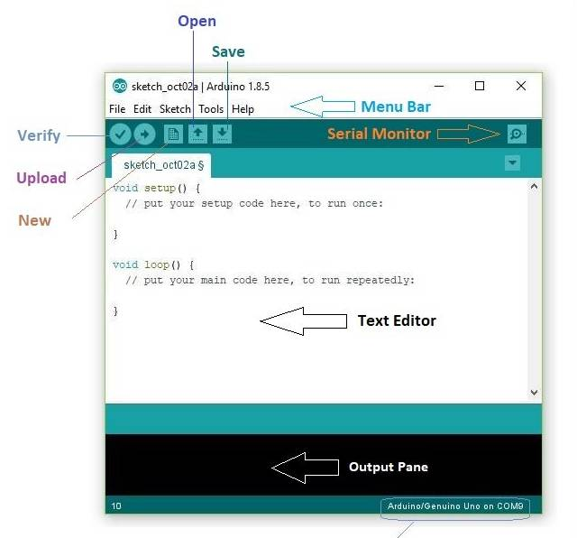
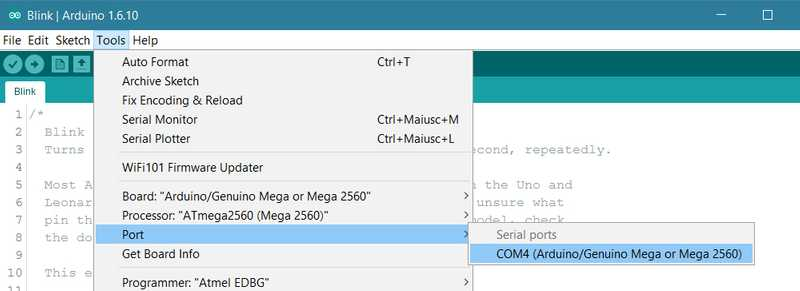
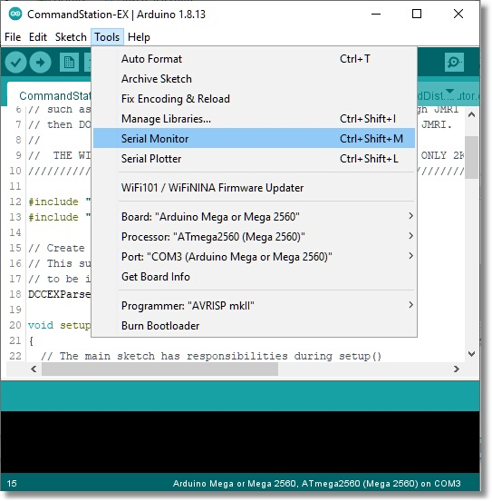
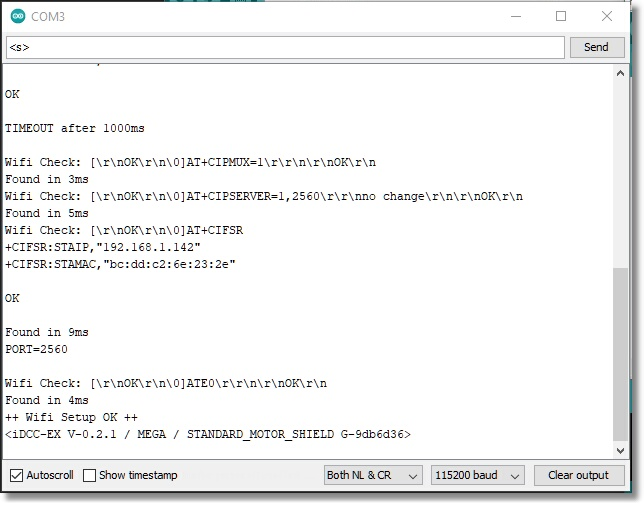

# Using a Serial Monitor / Device Monitor

With a Serial Monitor you can:

* Test your Command Station
* View startup and other diagnostic logs to fix issues or help us support you
* Turn on extra diagnostic commands
* Get the ID of a loco on the programming track
* Diagnose communication issues with your loco on the programming track (ACK failure/Error 308)
* Send commands to your WiFi board
* Manually control your locos
* Program CVs without the need for any other software

## What is a Serial Monitor and Why Do I Need One?

A Serial Monitor, or Device Monitor, is another name for a "terminal" program. It is software that runs on your computer or phone and connects to a serial port, like the USB connector on an Arduino, and lets you interact with your Command Station. The Arduino IDE has one built in as does our very own **EX-Installer**, which makes it a bit of a "Swiss Army Knife" in that it provides a way to upload software to your Command Station, and connect to it to view logs and send manual commands. If anything goes wrong with the **EX-CommandStation**, we will ask you to check the startup log with a Serial Monitor.

If you know how to use a terminal program it is as simple as connecting your device to the Command Station, opening a session and selecting the right baud rate (115200) and line endings (Carriage Return and Line Feed). For the rest of us, we will include detailed instructions on how to use a computer or a phone app to connect to your Command Station.

A number of different serial monitors are avalilable:

* [Connect with EX-Installer](#connect-with-ex-installers-device-monitor) (Recommended)
* [Connect with EX-WebThrottle](#connect-with-ex-webthrottle)
* [Connect with the Arduino IDE](#connect-with-the-arduino-ide-serial-monitor)
* [Connect with a Smart Device](#connect-with-a-smart-device)

----

## Connect with EX-Installer's Device Monitor

This is the simplest way to use **EX-Installer's* Device Monitor to show the serial output of your device.

For details, refer to [Testing with EX-Installer](../../installer/testing.md).

----

## Connect with EX-WebThrottle

Another simple way is to to use **EX-WEbThrottle's* Device Monitor to show the serial output of your device.

For details, refer to [Issuing Direct Commands with EX-Installer](/products/ex-webthrottle/ex-webthrottle.md#issuing-direct-commands).

----

## Connect with the Arduino IDE Serial Monitor

!!! important "The Arduino IDE is not recommended"

    While it is possible use the Arduino IDE, we *seriously* **DO NOT RECOMMEND IT** for anyone that is technically inexperienced. It is an order of magnitude more complex and much slower.

    Just run **EX-Installer** and :ref:`open the serial monitor in the [EX-Installer Device Monitor](../../installer/testing.md). 

### What You Will Need

* The Arduino IDE
* A Computer (Just about any Windows, Mac or Linux machine including the Raspberry Pi)
* The USB cable for your Arduino
  
### Download and install the Arduino IDE

Rather than go into details that are already covered in great detail on the Arduino web page, just follow the instructions in the following link and then return here.

[Arduino IDE Guide](https://www.arduino.cc/en/Guide)

### Run the Arduino IDE

Start the Arduino IDE. You should see something like this:

{ width=400px }

### Select the Correct COM Port

Select "Port" and find the port on your computer that recognises the Arduino. If you don't see a port listed there and are using a clone board, you may have to install a driver for a CH340 USB chip that is on these boards: see here `Drivers for the CH340 [https://learn.sparkfun.com/tutorials/how-to-install-ch340-drivers/all](https://learn.sparkfun.com/tutorials/how-to-install-ch340-drivers/all)

{ width=400px }

### Open the Serial Monitor

The Arduino IDE has a built in Serial Monitor. That means that in addition to uploading updates to your Command Station, we can interact with the Command Station. Select "Tools -> Serial Monitor", or click on the "serial monitor" icon near the upper right of the window.

{ width=400px }

Make sure the **baud rate at the lower right of the window is set to "115200"**. This is the data communication speed, equivalent to 115.2kb/s! **Make sure the dropdown next to that says "Both NL & CR"**. That makes sure you send a 'new line' command and 'carriage return' which the Arduino expects.

{ width=400px }

Serial Monitor - Note line ending and baud rate settings!

Opening the Serial Monitor always resets the Arduino board. Therefore, you should see a startup (boot) log immediately display in the window. If you have a Network shield or WiFi shield connected, you will see the Command Station setup its AP, or connect to your network if you gave it your credentials. If you don't have a network, that's fine; the Command Station will sense that, the network test will fail, but everything else will be working as it should.

### Enter Commands to the EX-CommandStation

There is an entire language that |EX-CS| understands. We call this the DCC-EX API for "Application Programming Interface". If you are interested, the list of all the commands is here in the :doc:`/reference/software/command-summary-consolidated`. Let's just try two commands to make sure everything is working.

All DCC-EX commands begin with a ``<`` and end with a ``>``. In the command window, type ``<1>`` and press the ``send`` button, or Enter on your keyboard. Power should come on to the main track. You should see 2 red LEDs light on the "A" power output of the |motor shield|.

Now enter ``<s>`` (lowercase). You should see status information for your Command Station appear in the log.

Turn off the power to the track by sending ``<0>`` to the CS. That is a "zero".

There are diagnostics to test CV reads and writes on the programming track, WiFi Diagnostics to test your connection to throttles like Engine Driver, Ethernet debugging,  and more. Read the documentation and experiment!

If you run into trouble, remember to send us a log by cutting and pasting the text from the Serial Monitor window to our support channel in [Discord](/support/support.md) or one of the other methods of [contacting us](/support/support.md).

----

## Connect with a Smart Device

### What You Will Need (Smart Device)

* A Smart Phone
* A Terminal program (see below)
* A USB "On The Go" Cable (aka. OTG Cable)
* The USB Cable for your Arduino

### USB OTG Cable

You will need to find a USN On-The-Go (OTG) cable that is compatible with your phone. Some phones come with one. It is usually Micro USB or USB-C or Apple Lightning on one end and USB 2.0 Female on the other. It acts like an adapter to connect a regular cable that would normally plug into a computer or laptop, and let it connect to your phone instead.

Here is an adapter:

[https://www.amazon.com/Thunderbolt-Compatible-Chromebook-Pixelbook-Microsoft/dp/B07KR45LJW/](https://www.amazon.com/Thunderbolt-Compatible-Chromebook-Pixelbook-Microsoft/dp/B07KR45LJW/)

Here is one for Android or MacBook Pro with USB-C with a short pigtail:

[https://www.amazon.com/Adapter-JSAUX-Compatible-MacBook-Samsung/dp/B07L749R9R/](https://www.amazon.com/Adapter-JSAUX-Compatible-MacBook-Samsung/dp/B07L749R9R/)

And one for an iPad or iPhone:

[https://www.amazon.com/dp/B09KBZDDGL/](https://www.amazon.com/dp/B09KBZDDGL/)

Every smart phone OS such as Android or iOS has a program or two that will work as a Serial Monitor. For Android, here are a few:

* [EX-Toolbox](/products/ex-toolbox/ex-toolbox.md) See [Using Serial Commands](../../products/ex-toolbox/user-guide.md#view-log) for details
* Serial USB Terminal by Kai Morich
* [Serial Monitor by CSA](https://play.google.com/store/apps/details?id=com.csa.serialmonitor)
* [USB Serial Console by Felipe Herranz](https://play.google.com/store/apps/details?id=jp.sugnakys.usbserialconsole>)
